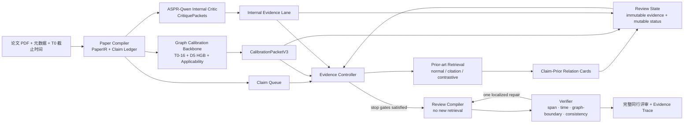

# ASPR-GEAR：图谱校准驱动、证据自适应的同行评审框架（最终设计版）

> 状态：最终算法设计冻结稿（尚未表示所有模块已经实现）  
> 日期：2026-08-10  
> 目标：输入一篇论文，输出一份完整、克制、证据可回溯的同行评审  
> 核心定位：**pre-publication graph calibration 是系统的科学主干；Agent 是围绕该主干进行证据获取、冲突解析和评审编译的受控执行层。**

---

## 0. 最终结论

建议将下一版系统命名为：

> **ASPR-GEAR — Graph-calibrated Evidence-Adaptive Reviewer**  
> **图谱校准驱动、证据自适应的科学同行评审系统**

最终版不再采用“固定五个审稿 Agent + 多轮讨论 + LATS 草稿树搜索”的主架构，而采用：

```text
一个有界 Evidence Controller
+ 三条彼此分工明确的证据通道
+ 一个只读、持续更新的 Review State
+ 一个受约束的 Review Compiler
+ 一个确定性优先的 Verifier
```

三条证据通道分别是：

1. **Pre-publication Graph Calibration**：给出发表时创新相关结构画像、五年后扩散预测及适用性边界，并控制检索预算、验证强度、语言强度和停止条件；
2. **Claim-level Prior-art Reasoning**：寻找直接先行研究，判断目标 claim 与已有工作的关系；这是“是否首创”的主要外部证据；
3. **ASPR-Qwen Internal Critic**：只检查论文内部的 claim、方法、实验、结果和结论是否互相支持；不负责凭记忆判断外部先行研究。

这三条通道不能投票平均，也不能混成一个不透明总分。对同一判断，证据优先级是：

```text
可验证的直接证据 > 派生的图谱校准证据 > 模型自报置信度
```

其中“直接证据”按任务分工：novelty 使用目标论文与先行研究的配对原文，方法学使用目标论文内部原文；二者解决不同问题，不作跨任务高低排序。

更精确地说：

- “某项贡献是否已有直接 antecedent”由 claim-level prior-art evidence 决定；
- “论文在发表时是否具有不寻常的知识组合，以及后续扩散潜力如何”由图谱校准给出；
- “方法和结果能否支持作者结论”由论文内部证据决定；
- 接收建议由上述可审计结论及问题严重性导出，**不得由 ASPR Score 直接决定**。

---

## 1. 证据冻结规则：只允许使用现行 Fig.1–Fig.3

### 1.1 唯一有效的图谱结果源

本设计只把以下结果视为现行、可引用、可进入算法契约的图谱证据：

| 图 | 允许使用的现行材料 | 在算法中的作用 |
|---|---|---|
| Fig.1 | `outputs/fig01/new/`、`docs/fig_readme/fig1new_multivariate_guide.md` | 证明发表时结构变化是多通道的；支持保留“知识整合、知识多样性、概念涌现”等分离画像 |
| Fig.2 | `outputs/fig02/new/`、`experiments/fig02/new/frozen_figure_spec.json`、`docs/fig_readme/fig2_new_evidence_architecture_guide.md` | 冻结测量证据链、指标角色、14 个硬门槛及四套嵌套特征集 |
| Fig.3 | `outputs/fig03/new/`、`innovation_impact_feature_selection/evidence_derived_v3/experiments/oof_feature_set_comparison_v3/outputs/hgb_uncapped_v2/` | 冻结正式 D5 × Full-text 16 × HGB 模型、ASPR Score 定义和 OOF/时间外验证边界 |

### 1.2 明确禁止进入本方案的材料

以下内容全部标记为 `deprecated_evidence`，不得用于算法选择、论文论据、数值报告、训练标签或最终评测：

- 旧 Fig.4–Fig.10 的所有数值、图、消融结果和由其导出的结论；
- `outputs/kg_perturbation_fig4_full50/`、`outputs/kg_perturbation_fig10/` 等旧实验；
- `data/review_innovation_opinions_v1/` 中从旧 Fig.4/Fig.10 派生的 50 篇 silver 数据；
- `aspr/graph_innovation_scorer.py` 的旧七指标局部近似分数；
- `aspr/nature_multihorizon/` 旧 dual-score release 对当前正式 Fig.3 模型的替代性解释；
- 任何“旧结果已经证明新 Agent 有效”的表述。

旧代码可以保留作历史兼容，但默认运行路径必须拒绝加载，并在 provenance 中记录：

```json
{
  "evidence_policy": "fig1_fig2_fig3_current_only",
  "deprecated_fig4_to_fig10_used": false
}
```

### 1.3 “发表当天”表述的真实边界

现行工程能够严格支持的边界是：

```text
T0 / publication-time information
且图谱来源满足 source_max_year < publication_year
```

它目前是严格的“发表前年份”门槛，不是精确到日的 `source_date < publication_date`。因此：

- 当前论文可表述为 **publication-time / pre-publication-year**；
- 若最终标题或正文要写“论文发表当天”，P0 必须补齐日级日期、版本日期和同日先后关系，并增加泄漏测试；
- 在该工程完成前，不能把“年份门槛”包装成“日级门槛”。

---

## 2. 基于当前仓库与数据的诊断

### 2.1 当前代码与最终目标之间的真实差距

| 当前模块 | 当前实际行为 | 为什么不足 | 最终处理 |
|---|---|---|---|
| `aspr/open_scholar.py` | 主入口接收 title、abstract、keywords；BGE-M3 召回、OpenScholar rerank 后取固定 top-N | 不是全文输入；难以给方法、表格、公式和结果提供内部证据 | 保留检索后端，入口改为 PDF/结构化全文；检索改为 claim-level、自适应停止 |
| `aspr/review_committee.py` | 正则抽 claim、token Jaccard 映射文献、固定五角色串行处理 | claim 粗糙；关系不等于相似度；同一图谱描述被贴到多个 claim；角色分数是启发式 | 退出默认主链；用 typed state + 有界 controller 替代 |
| `aspr/lats.py` | 多候选、反思、beam/tree search 优化评审草稿 | 主要搜索“文字版本”，不是搜索“缺失证据”；成本高且难追溯 | 默认停用；替换为 evidence-state diff 和最多一次局部修复 |
| `aspr/graph_innovation_scorer.py` | 从少量检索论文构造局部图并计算旧七指标加权分 | 不是现行 Fig.1–Fig.3 正式工作，且权重和语义已经过时 | 隔离为 legacy；不得进入新论文和默认运行 |
| `aspr/nature_multihorizon/scoring.py` | 旧 release 的 dual-score `ScorePacket` | 合同思想可借，但模型、特征数和适用范围不等于现行 Fig.3 | 新建 `CalibrationPacketV3`；不在旧包上偷换含义 |
| `aspr/graph_rag.py` | 通用文本 GraphRAG | 不能自然表达 claim—prior relation、时间截断和精确 span | 不进入 MVP 主链；citation graph 仅用于受控邻居扩展 |

### 2.2 当前数据检查

`data/paper_reconstruction_sft` 当前有 230 行、字段为 `inputs/outputs`。抽样显示：

- `inputs` 中已经是 `<comment>...审稿意见...</comment>`；
- `outputs` 基本是该审稿意见的重构或扩写；
- 因而当前本地快照不能被描述为“论文 x → 审稿意见 y”。

当前训练脚本还直接使用 `WestlakeNLP/DeepReview-13K`，而不是上述 230 行本地数据。最终设计接受“ASPR-Qwen 已经训练好”的项目假设，但将其输入输出合同重新定义为第 7 节的 `CritiquePacket`；后续训练必须按该合同重建样本，不能在论文中错误宣称现有 230 行已经完成 paper-to-review 配对。

`data/review_innovation_opinions_v1` 明确由旧 Fig.4/Fig.10 结果蒸馏而来。根据本设计第 1 节，它只保留历史审计用途，不能作为新 Agent 的训练、开发或测试集。

### 2.3 现行图谱资产已经足够成为主干，但尚未接入 Agent

正式模型资产已经存在：

- `official_hgb_model.joblib`：包含 two-part HGB、uptake calibrator、conditional calibrator；
- `official_model.json`：冻结 `D5 × fulltext_16 × hgb`；
- `official_aspr_scores.parquet`：冻结论文分数；
- `oof_predictions.parquet` 及总体、fold、domain 指标：支持追溯和适用性判断。

真正缺失的不是再训练一个图模型，而是：

1. 一个面向 Agent 的、角色分离的 `CalibrationPacketV3`；
2. 一个能对新论文做特征物化、适用性判定和拒答的 runtime adapter；
3. 一套把图谱校准用于检索策略、冲突检查、表述强度和停止条件的控制规则。

这三项正是 ASPR-GEAR 的主要算法贡献。

---

## 3. 科学问题必须拆开：不能用一个“创新分数”包打天下

ASPR-GEAR 同时回答四个不同问题，但不把它们混成一个标量：

| 判断对象 | 主要证据 | 可输出什么 | 禁止输出什么 |
|---|---|---|---|
| Claim-level novelty | 目标 claim 与时间截断后的先行研究原文关系 | antecedent、partial antecedent、extension、parallel、unresolved | “图谱分高，所以该 claim 首创” |
| Publication-time structural profile | T0 的实质创新/潜力通道 | 知识整合、多样性、概念涌现、知识新旧等画像 | “这是创新真值”或因果机制 |
| Prospective diffusion | 正式 D5 two-part HGB + ECDF | 后续科学扩散的相对筛选/排序信号 | 质量、接收概率、社会影响、因果效应 |
| Method/result validity | 论文正文、公式、表格、实验和结果 | 支持、不支持、不清楚、内部不一致、需补实验 | 由外部图谱替代方法学审查 |

可以形式化为：

```text
Graph calibration:       G(p) = {profile, D5 forecast, applicability, provenance}
Prior-art relation:      R(c, r) = relation between target claim c and prior work r
Internal critique:       M(c) = paper-internal support/contradiction for c
Evidence controller:     π(S) -> next bounded evidence action
Final review:            Compile(ResolvedReviewState), then Verify
```

核心约束是：

```text
G(p) 不是 Novelty(c)
ASPR Score 不是 AcceptanceProbability(p)
LLM confidence 不是 EvidenceConfidence
```

---

## 4. 总体架构



该架构只有一个真正的运行时控制器。图中的 `Graph Calibration`、`ASPR-Qwen`、`Prior-art` 是证据服务，不是假装独立人格的“委员”。这样既降低复杂度，也避免多个 Agent 用自然语言重复转述相同信息。

---

## 5. 第一主干：Pre-publication Graph Calibration Backbone

本节应当成为最终论文的方法与实验主体。建议图谱工作及其 Agent 耦合占全文 **55%–60%**，不是把 Fig.1–Fig.3 当背景介绍后在 Agent prompt 里附一个分数。

### 5.1 Fig.1 给 Agent 的不是一个分数，而是“多通道结构画像”

现行 Fig.1 用四个 landmark case 展示 topic-coupling transition，并用三个维度、六个 T0 特征刻画相对前期的多变量位移：

- 跨学科知识整合：`EF0017`；
- 知识多样性：`EF0309 / EF0312 / EF0315 / EF0318`；
- 概念涌现：`EF0240`。

四个案例的 LM/Early/Late 位移分别为：

| Case | LM | Early | Late | 正确解释 |
|---|---:|---:|---:|---|
| CRISPR-Cas | 7.9 | 5.3 | 8.1 pp | 图结构变化与特征空间位移不必同步 |
| Graphene | 6.3 | 8.9 | 13.3 pp | 描述性结构变化 |
| Click chemistry | 10.3 | 25.7 | 22.1 pp | 描述性位移，不是因果效应 |
| GWAS | 6.9 | 11.8 | 8.2 pp | 描述性位移，不是 novelty truth |

因此 Agent 侧必须保留各通道，而不能把它们压成“图谱创新性 = 0.83”。Fig.1 最重要的算法启示是：

> **结构图、发表时特征画像、直接先行研究关系和后续扩散预测可以出现张力；张力本身应触发核查，而不是被平均掉。**

### 5.2 Fig.2 冻结了“为什么测这些东西”

现行 Fig.2 是测量证据链，不是模型效果图：

```text
英文、论文级、T0-only、outcome-blind 的来源证据
→ 42 个检索概念域
→ 336 个逻辑检索式 / 367 个物理查询
→ 30,332 条唯一正式记录 / 363 个纳入来源
→ 1,685 次指标提及 / 432 个规范指标家族
→ 66 个候选维度
→ 14 个冻结硬门槛
→ 7 ⊂ 16 ⊂ 154 ⊂ 221
```

必须保留 Fig.2 的四类角色：

1. `direct_innovation`；
2. `t0_substantive`；
3. `t0_opportunity`；
4. `context_control`。

机会变量和控制变量可以帮助 D5 预测，但不能被 Review Compiler 写成“该论文更创新”的理由。`Full-text 16` 中的“Full-text”指指标来源具有英文全文/公式证据层级，**不是指目标论文只要有全文就自然获得 16 个特征**。

Fig.2 的 R12 是务实停止：当轮仍新增 10 个术语家族和 9 个指标家族，不能写成双零统计饱和。119 次 AI review、50,314 个 reviewed rows 也不能写成 119 位人工评审或 50,314 篇论文。

### 5.3 Fig.3 冻结正式预测模型

正式模型是：

```text
Horizon:      D5
Feature set:  Full-text 16
Model:        two-part HGB
Corpus:       411,490 篇 Nature / Nature Communications / Scientific Reports 论文
Domains:      12 个自然科学领域
```

模型分两步：

```text
raw = calibrated P(future uptake >= 1)
      × calibrated E(cross-field diffusion | uptake > 0)

ASPR Score = 100 × ECDF_D5_mature(raw)
```

现行 Fig.3 可以报告的关键事实包括：

- D5 × Full-text 16 总体 OOF Spearman = **0.737112**；
- D3 / D5 / D8 的 Full-text 16 OOF Spearman 分别为 **0.716019 / 0.737112 / 0.772332**；
- D5 最高预测十分位中，真实结果 top-decile 占比为 **42.08%**，相对约 10% 基线 lift 为 **4.21×**；
- Full-text 16 相对 Strict 7 的可靠 domain-year cell 中，D5 Spearman 增量中位数约 **+0.0102**，约 **76.0%** 为正；
- Primary 154 和 Broad T0 221 没有带来稳定的大幅增益，说明这里存在预测饱和，但不能据此宣称更广指标在科学上“无用”；
- 后期 forward folds 性能下降：Full-text 16 在 2014–2017 和 2018–2020 测试块约为 **0.6543 / 0.6280**，因此 runtime 必须显式考虑时间漂移。

上述是对后续 uptake/diffusion 的预测关联，不是因果、直接创新、论文质量或接收概率。

还需区分两层“结果盲”：Fig.2 中各特征集合的**成员资格**由来源证据和冻结门槛决定，不看后续结果；Fig.3 把 Full-text 16 冻结为正式模型，则依据“预先指定 D5 目标 + 四套冻结集合中最佳 D5 OOF 表现”。因此不能把正式模型选择也描述成完全 outcome-blind。Fig.2 的 Primary 154 仍是更宽的来源证据集合，但 Agent runtime 应服从现行 Fig.3 的正式模型选择，使用 Full-text 16。

### 5.4 Full-text 16 必须按角色保存

| 角色 | 特征 | Agent 中允许的用途 |
|---|---|---|
| 实质创新内容 | EF0017 Additive entropy diversity；EF0052 Backward-citation age；EF0240 New-concept birth | 形成结构画像，触发先行研究核查；单个特征不能独立证明创新 |
| T0 实质潜力 | EF0309 Rao–Stirling；EF0312 Reference balance；EF0315 Reference disparity；EF0318 Reference variety | 描述知识多样性与整合潜力 |
| 机会条件 | EF0083 Collaboration-network clustering；EF0186 International collaboration；EF0188 Country count；EF0238 Bibliographic-coupling centrality；EF0319 Relative algebraic connectivity | 解释潜在扩散机会与团队/网络条件，不得写成创新证据 |
| 背景控制 | EF0038 Author count；EF0197 Journal identity；EF0307 Publication year；EF0314 Reference count | 只用于模型控制、适用性和校准，不进入创新叙述 |

还必须披露局部 operationalization：`EF0017`、`EF0083`、`EF0240`、`EF0319` 使用透明的本地 surrogate；尤其 `EF0240` 不使用未来重度使用条件。Agent 输出不能把 surrogate 写成原始来源公式的逐字复现。

### 5.5 新的 `CalibrationPacketV3`

不要直接复用旧 `ScorePacket` 的名称和语义。建议建立以下稳定合同：

```json
{
  "contract": "aspr_calibration_packet_v3",
  "paper_id": "...",
  "cutoff": {
    "publication_date": null,
    "publication_year": 2026,
    "source_max_year": 2025,
    "granularity": "year"
  },
  "measurement": {
    "feature_set": "fulltext_16",
    "feature_version": "...",
    "substantive_innovation": {},
    "t0_potential": {},
    "opportunity": {},
    "context_control": {},
    "local_surrogates": ["EF0017", "EF0083", "EF0240", "EF0319"]
  },
  "forecast": {
    "horizon": 5,
    "p_uptake": null,
    "conditional_diffusion": null,
    "raw_expected_diffusion": null,
    "aspr_score_0_100": null,
    "reference_corpus": "nature-mature-d5"
  },
  "reliability": {
    "mode": "exact_lookup|eligible_inference|profile_only|unavailable",
    "domain": null,
    "domain_support_n": null,
    "temporal_block": null,
    "feature_coverage": 0.0,
    "missing_features": [],
    "drift_flags": [],
    "quality_flags": []
  },
  "interpretation": {
    "allowed": [
      "publication-time structural profile",
      "relative prospective scientific diffusion signal"
    ],
    "prohibited": [
      "direct novelty truth",
      "causal impact",
      "paper quality",
      "acceptance probability",
      "social impact"
    ]
  },
  "provenance": {
    "model_family": "hgb",
    "model_sha256": "...",
    "score_table_sha256": "...",
    "evidence_policy": "fig1_fig2_fig3_current_only"
  }
}
```

`p_uptake`、`conditional_diffusion` 与最终乘积应分别保留，避免一个高分掩盖两种不同来源。`aspr_score_0_100` 只是在成熟 D5 cohort 中的经验分位，不是概率。

### 5.6 四级适用性门控

ASPR 的目标是评审一般论文，但现行正式模型是在特定 Nature portfolio 与自然科学域上训练的。必须拒绝“一个分数全球通用”的假设。

| 模式 | 条件 | 可用输出 | Agent 行为 |
|---|---|---|---|
| A `exact_lookup` | 论文存在于冻结正式 score table | 完整画像、正式分数、现有 provenance | 正常使用，同时显示历史 cohort 语义 |
| B `eligible_inference` | 新论文属于支持域、16 特征可物化、元数据覆盖达标 | 完整画像和预测，但加 extrapolation/drift flag | 可用于预算与措辞校准；不得声称同等验证强度 |
| C `profile_only` | 域外论文或 journal/category 映射不成立，但部分 T0 实质特征可靠 | 只输出分角色画像；不输出正式 D5 ASPR percentile | 继续 prior-art 和内部审查；图谱不参与扩散结论 |
| D `unavailable` | 时间、参考文献、作者/机构或特征数据不足 | 仅给缺失原因 | 系统仍应完成评审，明确 graph evidence unavailable |

计算机科学会议论文等域外对象，默认不能直接套用 Nature cohort 的 D5 ECDF。若未来要扩展，必须建立独立外部校准集并通过时间外验证，而不是只修改 prompt。

### 5.7 图谱与 Agent 的紧耦合点

#### 耦合一：检索前的证据预算

图谱在任何外部先行研究结论形成前就进入 `ReviewState`，用于决定哪里需要更深核查：

| 条件 | Controller 动作 |
|---|---|
| 实质画像极端或 D5 位于最高十分位，且作者使用 strong novelty claim | 对该 claim 增加一次 contrastive query 和一次 citation-neighbor expansion |
| 实质画像普通但作者声称“first/breakthrough/paradigm shift” | 优先检查 overclaim；不能因图谱普通直接判不新颖 |
| 实质画像高，但 normal retrieval 找到 direct antecedent | 保留 antecedent 结论；将图谱解释为“可能具有扩散/重组潜力的 extension”，不能覆盖先行研究 |
| 画像与 forecast 明显分离 | 分开解释“创新相关结构”和“扩散机会”，不求平均 |
| `profile_only` 或 `unavailable` | 不增加图谱驱动结论；把预算转给直接证据 |

最高/最低十分位只是可复现的策略触发器，不是新的科学类别。阈值需要在独立开发集预注册，不能在测试结果上反复调整。

第一版可以用以下确定性策略把这种耦合写成可复现算法，而不是留在 prompt 直觉里：

```text
normal_rounds(c) = 1 + I(retrieval_coverage_after_round1 = LOW), capped at 2

contrastive(c) = I(
    author_claim_strength = STRONG
    and (graph_extreme = TRUE or relation_stability = LOW)
)

citation_expand(c) = I(
    retrieval_coverage = LOW
    and (author_claim_strength = STRONG or graph_extreme = TRUE)
)

stability_test(c) = I(
    graph_text_state = TEXT_GRAPH_TENSION
    or verdict_can_change_recommendation = TRUE
)
```

其中 `graph_extreme` 只在 packet 适用时成立：正式 ASPR decile 为 D1/D10，或预注册的实质画像通道越过极端阈值。上述指示量只增加核查，不直接改变 novelty label。

#### 耦合二：证据冲突检查

每个主要 novelty claim 生成一个 `Graph–Text Consistency` 状态：

```text
CONCORDANT_HIGH      无 direct antecedent + 强图谱实质画像
CONCORDANT_LIMITED   有 antecedent/extension + 普通或弱画像
TEXT_GRAPH_TENSION   直接证据与图谱画像方向不一致
GRAPH_UNAVAILABLE    图谱不能安全使用
```

`TEXT_GRAPH_TENSION` 只触发一次定向检查，不能触发无界讨论。典型解释矩阵如下：

| 直接先行研究 | 图谱实质画像 | 允许的最终解释 |
|---|---|---|
| 未发现强 antecedent | 高 | “在当前检索范围内具备较强 claim-level 新颖性证据，并呈现不寻常 T0 结构；仍受检索覆盖限制” |
| 未发现强 antecedent | 低/普通 | “可能具有局部新颖性，但结构画像未显示显著偏离；不能由此否定 novelty” |
| 存在强 antecedent | 高 | “核心原理并非首创，但组合、规模、证据或传播条件可能具有显著增量” |
| 存在强 antecedent | 低/普通 | “更接近已有工作的局部 extension；按直接关系证据陈述” |

#### 耦合三：最终语言强度

图谱可以降低或限制“潜在影响力”措辞，但不能独立抬高“首创性”措辞。最终语言由三类状态共同确定：

```text
novelty wording     <- prior-art relation + retrieval coverage/stability
impact wording      <- graph forecast + applicability/drift
validity wording    <- internal evidence + unresolved severity
```

#### 耦合四：停止条件

Graph packet 参与定义“还缺什么证据”，例如：

- 高分且 strong claim 尚未进行 contrastive retrieval：不能停止；
- `TEXT_GRAPH_TENSION` 尚未完成一次稳定性测试：不能停止；
- graph 只处于 `profile_only`，却在草稿中出现 D5 扩散结论：Verifier 必须阻止停止；
- graph 不可用但已明确披露，且 direct/internal evidence 已满足：可以停止。

### 5.8 图谱 runtime 必须通过的验收测试

1. 对冻结论文 lookup 的 ASPR Score 与 `official_aspr_scores.parquet` 精确一致；
2. 模型 SHA256、feature set、ECDF reference 和 cutoff 写入每个 packet；
3. `source_max_year >= publication_year` 时硬失败，不静默计算；
4. 任一 opportunity/control 字段进入 novelty evidence 文本时测试失败；
5. 域外论文默认 `profile_only` 或 `unavailable`，不能伪造正式 percentile；
6. local surrogate 在输出中保留标记；
7. 缺失值不能自动替换成“低创新”；
8. 旧 Fig.4–Fig.10 路径或旧七指标 scorer 被加载时测试失败。

---

## 6. Paper Compiler：先把论文变成可引用对象

最终系统入口必须从 title/abstract 升级为 PDF 或等价结构化全文。建议输出不可变的 `PaperIR`：

```json
{
  "paper_id": "...",
  "metadata": {
    "title": "...",
    "authors": [],
    "venue": null,
    "publication_date": null,
    "submission_date": null,
    "doi": null
  },
  "sections": [],
  "paragraphs": [],
  "sentences": [],
  "figures": [],
  "tables": [],
  "equations": [],
  "references": [],
  "citation_contexts": [],
  "claims": [],
  "method_objects": [],
  "result_objects": []
}
```

每个对象必须带：

```text
page / section_path / stable_span_id / char_start / char_end / text_hash
```

### 6.1 Claim Ledger

claim 不只从摘要中的 `we propose` 正则抽取。至少分为：

- `novelty_claim`：首次、不同于已有工作、新机制；
- `method_claim`：算法或实验设计如何工作；
- `result_claim`：数值改善、统计显著性、鲁棒性；
- `scope_claim`：适用范围、泛化；
- `causal_claim`：因果或机制性结论；
- `significance_claim`：潜在影响和重要性。

每个 claim 绑定作者原文 span、claim strength、依赖的图表/实验，以及需要的证据类型。无法定位到原文的 claim 不得进入最终评审为事实，只能作为待确认问题。

### 6.2 Method/Result Ledger

为方法学评论建立最小结构：

```text
research question
dataset / sample / inclusion
design / intervention / comparator
model / algorithm / loss / assumptions
baselines / metrics / statistical tests
ablation / sensitivity / robustness
main numeric results
limitations stated by authors
```

系统可以从论文结构动态生成 `ReviewChecklist`，用来发现未检查项；但它不是自动生成的“评测 gold rubric”。最终 benchmark 的 rubric 必须由专家预先编写并与生成过程隔离，避免循环评价。

---

## 7. ASPR-Qwen 的最终角色与训练合同

### 7.1 不让 Qwen 直接写最终评审

ASPR-Qwen 的最合适角色是 **paper-internal evidence critic**。它输出原子化、可验证的 critique candidate，而不是一篇已经定稿的同行评审。

原因是：

- 训练数据中的 review y 可以教会模型审稿关注点和问题模式；
- 但外部先行研究、图谱分数和检索覆盖必须来自工具，不能让模型凭参数记忆生成；
- 让 Qwen 输出结构化卡片，更容易与 prior-art 和 graph packet 对齐，也更容易拒绝无证据内容。

### 7.2 建议的 `CritiquePacket`

```json
{
  "critique_id": "QW-...",
  "target_claim_id": "C-...",
  "aspect": "method|experiment|result|conclusion|clarity",
  "verdict": "supported|unsupported|unclear|internally_inconsistent",
  "finding": "...",
  "paper_evidence": [
    {
      "span_id": "S-...",
      "page": 4,
      "text_hash": "..."
    }
  ],
  "severity": "minor|major|critical",
  "missing_check": "...",
  "suggested_revision": "...",
  "external_knowledge_required": false
}
```

硬约束：

- `paper_evidence` 至少一个 span；
- span 必须能在 `PaperIR` 中精确匹配，否则卡片作废；
- 若问题依赖学科外部知识，设置 `external_knowledge_required=true`，交由外部证据通道确认；
- 模型不得输出 ASPR Score、先行研究事实或接收建议；
- 模型自报 confidence 不进入最终置信度。

### 7.3 训练数据重建

用户允许假设模型已经训练完成，因此算法论文可按以下目标合同描述它；工程上仍需完成数据重建：

```text
x = PaperIR 中与某个 claim/审查任务相关的全文片段 + 表/图/公式上下文
y = 从真实审稿意见原子化、并重新对齐到论文 span 的 CritiquePacket 集合
```

构建流程：

1. 将 review y 拆成单一 finding；
2. 标注 aspect、severity、required revision；
3. 在源论文中寻找支持该 critique 的最小 span；
4. 无法对齐的条目降级为 `question` 或丢弃，不能训练为确定事实；
5. 加入“论文实际上已经报告该内容”的 hard negative，降低虚假缺失指控；
6. 按 paper、venue、year 分组切分，防止同一论文或同一审稿意见泄漏到 train/test；
7. 输出严格 JSON，并用 schema validator 和 span validator 过滤。

当前 230 行 reconstruction 数据可以用于风格预训练或格式暖启动，但在重新找回原论文并完成 span alignment 前，不能作为最终 paper-to-critique 监督数据。

### 7.4 推理方式

第一版只需一次低温度结构化生成：

```text
PaperIR -> claim/method-specific context retrieval -> ASPR-Qwen -> CritiquePackets -> validator
```

只在关键方法问题出现内部矛盾时允许一次 targeted re-check。不要让 Qwen 多轮自我讨论，也不要让多个相同模型通过“投票”制造伪独立性。

---

## 8. Claim-level Prior-art Engine

### 8.1 检索顺序

每个主要 novelty claim 使用三个来源，顺序固定：

1. **作者已引文献**：参考文献及其 citation context；
2. **未引先行研究**：Semantic Scholar/OpenAlex 召回；
3. **citation neighbors**：只在覆盖不足或高风险 claim 上扩一跳。

所有候选必须通过时间截断：

```text
prior_work_date < manuscript_cutoff_date
```

如果只能获得年份，则把同年关系标为 `temporal_order_unresolved`，不能默认为先行研究。

### 8.2 Query family

每个 claim 最多使用：

- 1 个 lexical query：作者原术语；
- 1 个 mechanism/task query：去掉论文品牌名，保留机制、问题、输入输出；
- 对 high-risk claim 再加 1 个 contrastive query。

contrastive query 只采用一种最有信息量的变化：

- 去除作者命名的方法名；
- 将具体应用换成上位任务；
- 将“联合组件”拆成核心机制；
- 将强 claim 改写为可能的 antecedent 表述。

这里借鉴 CF-RAG 的“相关查询也应接受区分性检验”，但 ASPR 不宣称这等于因果证明，也不照搬多 cluster、多 hypothesis、top-3 synthesis 的完整架构。

### 8.3 Relation schema

相似度高不等于 antecedent。最终关系分类固定为：

| Label | 含义 | 对 novelty 的作用 |
|---|---|---|
| `DIRECT_ANTECEDENT` | 核心问题、机制和关键贡献已被先前工作实现 | 反驳“核心首创” |
| `PARTIAL_ANTECEDENT` | 一部分组件或思想已存在 | 支持增量/组合创新表述 |
| `EXTENSION` | 目标工作扩展数据、规模、场景、效率或理论 | 判断增量性质 |
| `PARALLEL` | 同期或独立相似路线，时间先后不清 | 要求克制，不作明确抢先结论 |
| `SUPPORT` | 支持背景、动机或方法合理性 | 不是 novelty 反证 |
| `CONFLICT` | 先前结果与目标结论直接冲突 | 进入方法/结论审查 |
| `DISTANT` | 主题相关但不能直接比较 | 不得拿来凑 prior-art 数量 |
| `UNRESOLVED` | 全文、日期或关键细节不足 | 明示不确定性 |

每个 `RelationCard` 必须同时绑定：

```text
target_claim_span
prior_work_span
prior_work_metadata + date
relation_label
difference_dimensions
retrieval_query_id
```

SciNet 可作为 relation-aware scientific retrieval 的研究动机和未来 benchmark 来源，但上述标签是 ASPR 为 novelty review 自行定义的任务合同，不能声称是 SciNet 原标签。

### 8.4 检索停止

不再固定“永远 top-10”。单个 claim 的默认上限：

```text
normal retrieval rounds       <= 2
contrastive query             <= 1
citation-neighbor expansion   <= 1
full-text prior papers kept   <= 12
```

满足以下条件即可停止：

- 至少一个 query family 有全文或可靠摘要证据；
- strong claim 已完成 mechanism/task query；
- 高风险或 graph-text tension 已完成一次 contrastive check；
- 新一轮没有产生新关系类型或改变结论；
- 所有保留关系都有可验证 span 或明确 `UNRESOLVED`。

---

## 9. Review State 与 Evidence Controller

### 9.1 状态优先，而不是角色优先

建议使用一个共享、typed、append-only evidence store。可变的只是状态判断，原始证据不可覆盖。

```json
{
  "claim_id": "C-01",
  "claim_type": "novelty_claim",
  "author_span_id": "S-118",
  "author_strength": "strong",
  "internal_evidence_ids": [],
  "prior_relation_ids": [],
  "graph_consistency": "UNASSESSED",
  "retrieval_coverage": "LOW",
  "stability": "UNTESTED",
  "status": "OPEN",
  "verdict": null,
  "allowed_wording": null,
  "unresolved": []
}
```

系统同时保存：

- immutable evidence log：原文 span、检索结果、工具输入输出、模型/数据 hash；
- compact working state：每个 claim 当前结论和待办；
- failure ledger：哪些查询无效、哪些 span 验证失败、哪些路径已经尝试。

这吸收 IterResearch/MEM1 的紧凑工作记忆思想，但不丢弃审计历史。

### 9.2 有限动作空间

Controller 只允许以下动作：

```text
COMPILE_PAPER
MATERIALIZE_CALIBRATION
RUN_INTERNAL_CRITIC
RETRIEVE_PRIOR_ART
EXPAND_CITATION_NEIGHBOR
RUN_CONTRASTIVE_RETRIEVAL
CLASSIFY_RELATION
CHECK_INTERNAL_METHOD
TEST_STABILITY
RESOLVE_CLAIM
VERIFY_STATE
FINALIZE
```

不允许任意“再思考一下”、任意创建新 Agent 或无界搜索。

### 9.3 Rule-first controller

第一版不用强化学习，也不用 LLM 动态设计 Agent topology。规则足以覆盖核心决策：

```python
while not terminal(review_state):
    claim = highest_priority_open_claim(review_state)

    if calibration_missing(claim.paper):
        action = MATERIALIZE_CALIBRATION
    elif internal_support_missing(claim):
        action = RUN_INTERNAL_CRITIC
    elif prior_art_coverage_low(claim):
        action = RETRIEVE_PRIOR_ART
    elif needs_contrastive_check(claim):
        action = RUN_CONTRASTIVE_RETRIEVAL
    elif relation_unresolved(claim):
        action = CLASSIFY_RELATION
    elif is_high_stakes(claim) and not stability_tested(claim):
        action = TEST_STABILITY
    else:
        action = RESOLVE_CLAIM

    execute_once(action)
    append_evidence_and_update_state()

VERIFY_STATE
FINALIZE
```

优先级由以下可解释规则决定：

1. critical/major 方法问题；
2. strong novelty/causal/significance claim；
3. graph-text tension；
4. 会改变总体推荐的问题；
5. 其余次要问题。

### 9.4 稳定性而不是自报置信度

对高影响判断最多进行三种轻量测试：

- `remove_graph`：去掉图谱后，claim-level novelty verdict 是否改变；正常情况下不应改变 antecedent 结论；
- `remove_top_prior`：去掉 top-1 prior 后，结论是否仍有独立证据；
- `alternate_query`：改用 mechanism query 后，关系是否稳定。

第一版不输出伪精确的 0.83 “评审正确率”。分别报告：

```text
direct_evidence_strength
retrieval_coverage
relation_stability
graph_applicability
internal_span_support
```

积累足够带 success/error 标签的真实 trajectory 后，再借鉴 Holistic Trajectory Calibration，用跨步骤变化、失败/修复次数、证据覆盖和结构属性训练小型可解释 calibrator，并用 ECE/Brier/AUROC 评价。不能把论文中 HTC 的 48 维 log-probability 特征未经验证直接复制到 ASPR。

### 9.5 停止条件

只有同时满足以下条件才能进入编译：

1. 所有 major claims 已为 `RESOLVED` 或明确 `UNRESOLVED_WITH_REASON`；
2. novelty 结论至少绑定一个 target span，并对强 claim 完成外部检索；
3. 方法学主要判断绑定论文内部 span；
4. graph packet 已生成或记录不可用原因；
5. graph-text tension 已完成一次定向检查；
6. 没有未经支持的强措辞；
7. 继续检索的边际证据增益为零，或已达到预注册预算上限；
8. 可生成完整评审的所有必填槽位。

SupervisorAgent 的启发在这里被压缩成规则触发和最多一次局部指导，不引入另一个长期对话式 supervisor。

---

## 10. Review Compiler 与 Verifier

### 10.1 Compiler 只读已解决状态

Compiler 阶段禁止新检索、禁止创造新事实。它只能把 `ResolvedReviewState` 编译成：

1. 论文工作与贡献摘要；
2. 主要优点；
3. 主要缺点；
4. 创新性与先行研究比较；
5. pre-publication graph calibration 与潜在扩散解释；
6. 方法、实验、统计和结果审查；
7. 结论是否过度声称；
8. 作者必须回答的问题；
9. 次要问题；
10. 总体推荐与分项置信说明；
11. machine-readable evidence trace。

每条 major statement 都带内部 citation key，例如：

```text
[P:S-118]             目标论文 span
[R:W-203:S-44]        先行研究及 span
[G:CPV3:forecast]      图谱 packet 字段
[Q:QW-17]             已通过 span 验证的 Qwen critique
```

面向人类的正文可以隐藏冗长 ID，但附件/JSON 必须保留完整映射。

### 10.2 Verifier 的硬规则

Verifier 先用确定性规则，再用一次受约束 LLM 检查：

- span 是否存在、hash 是否匹配；
- prior work 是否在时间截断之前；
- 引用是否真的支持相邻判断；
- opportunity/control 是否被误写为创新机制；
- ASPR Score 是否被误写为概率、质量、因果或接收预测；
- `profile_only` 是否错误输出 D5 percentile；
- novelty、method、recommendation 是否互相矛盾；
- 结论强度是否超过 evidence state 的 `allowed_wording`；
- 是否遗漏 major issue；
- 是否出现 Review State 中没有来源的新事实。

若失败，只允许对失败段落做一次 localized repair；第二次仍失败则输出保守版本并显式披露 unresolved issue。不要重新运行整棵 LATS 树。

### 10.3 推荐不是图谱阈值

建议由问题严重性和可修复性导出：

```text
critical validity flaw / unsupported central claim
major but repairable issue
minor issue
```

图谱高分不能挽救方法无效的论文；图谱普通也不能拒绝一篇方法严谨、claim-level 新颖的论文。

---

## 11. 端到端算法

```text
Input: manuscript PDF P, metadata M, review cutoff T0

1. Compile P into PaperIR; extract claims, method objects, results and stable spans.
2. Build CalibrationPacketV3:
   a. enforce T0 provenance;
   b. materialize the 16 frozen features by role;
   c. determine applicability mode;
   d. if eligible, run official D5 two-part HGB and frozen ECDF;
   e. attach drift, missingness, surrogate and provenance flags.
3. Run ASPR-Qwen once on claim/method-specific PaperIR contexts.
   Reject every CritiquePacket whose evidence spans do not validate.
4. Initialize ClaimStates and compute review priorities using:
   author claim strength, internal-risk severity, graph profile/forecast,
   graph applicability, and evidence gaps.
5. For each high-priority claim:
   a. retrieve cited and uncited prior art under T0 cutoff;
   b. classify claim-prior relations with paired spans;
   c. if strong/high-risk/tension, run one contrastive query;
   d. expand one citation hop only if relation coverage remains low;
   e. update graph-text consistency and unresolved fields.
6. For major method/result claims, reconcile ASPR-Qwen findings with PaperIR.
7. Run stability tests only for high-stakes judgments.
8. Stop when evidence-completeness and budget gates are met.
9. Compile the complete review from resolved state only.
10. Verify traceability, temporal validity, graph interpretation and consistency.
11. Perform at most one localized repair.

Output: human-readable peer review + structured Evidence Trace.
```

复杂度受明确上限控制。一次论文评审没有固定 N 个 Agent，也没有随草稿质量无限增长的搜索树。

---

## 12. 建议代码结构与迁移路线

### 12.1 新目录

```text
aspr/gear/
├── contracts.py                 # PaperIR / ClaimState / RelationCard / CalibrationPacketV3
├── paper_compiler.py            # PDF -> stable spans and ledgers
├── calibration_adapter_v3.py    # 现行 Fig.1–Fig.3 runtime 接口
├── applicability.py             # domain/time/coverage/drift gates
├── qwen_critic.py               # ASPR-Qwen structured inference + validation
├── prior_art.py                 # query planning, retrieval, temporal filter
├── relation_classifier.py       # paired-span relation classification
├── controller.py                # finite rule-first policy
├── stability.py                 # remove/alternate evidence tests
├── compiler.py                  # state -> complete review
├── verifier.py                  # deterministic rules + localized repair
├── trace.py                     # immutable provenance/evidence log
└── pipeline.py                  # public PDF-to-review entrypoint
```

### 12.2 可复用资产

- 从 `open_scholar.py` 复用 Semantic Scholar/OpenAlex 客户端、BGE-M3 recall 和 OpenScholar reranker；
- 从 evidence-derived v3 复用冻结特征定义与 materializer；
- 直接加载现行 `official_hgb_model.joblib` 和正式 ECDF reference；
- 从 PDF 处理代码复用基础提取，但生产版建议接 GROBID，保留 page/section/citation context；
- 保留现有 prompt 中有用的完整评审格式，但删除让模型自评 graph alignment 的伪评分。

### 12.3 退出默认主链但不删除

```text
aspr/review_committee.py
aspr/lats.py
aspr/graph_innovation_scorer.py
aspr/graph_rag.py
旧 nature_multihorizon dual-score adapter
```

保留它们用于历史复现；新入口不得静默回退。建议通过显式 `--legacy-*` 开关才能运行。

### 12.4 P0：先冻结合同和证据边界

完成条件：

1. 新 contracts 和 JSON schema；
2. current-only evidence allowlist；
3. old Fig.4–Fig.10 denylist 测试；
4. 正式 HGB lookup 对齐测试；
5. year/day cutoff 测试；
6. `exact_lookup / eligible_inference / profile_only / unavailable` 四级 gate；
7. PDF -> stable span 的最小实现。

### 12.5 P1：可工作的 vertical slice

路径：

```text
PDF -> PaperIR -> CalibrationPacketV3
    -> ASPR-Qwen CritiquePackets
    -> claim-level retrieval/relation
    -> ReviewState -> Compiler -> Verifier -> review
```

第一版限制：每个 claim 两轮普通检索、一次 contrastive、一次 repair。只需规则 controller。

### 12.6 P2：提高关系和内部证据质量

- 重建 ASPR-Qwen paper-to-CritiquePacket 数据；
- 完成 prior-paper full text 和 citation context；
- 建立 paired-span relation annotation；
- 加入 method-specific checklist；
- 记录所有 trajectory feature，但暂不训练 confidence model。

### 12.7 P3：校准与论文实验

- 建立独立的 agent benchmark；
- 训练可解释的 process calibrator；
- 完成 graph integration ablation、OOD/drift、risk-coverage 和人类盲评；
- 冻结新 Fig.4 之后的结果。旧 Fig.4–Fig.10 不复用。

---

## 13. 新评测方案：不使用旧 Fig.4–Fig.10

以下全部是**拟开展的新实验**，不能在完成前写成已有结果。

### 13.1 E0：Graph runtime fidelity

目的：证明 Agent 使用的就是现行 Fig.3 模型，而不是相似实现。

指标：

- frozen lookup score exact match；
- raw/percentile 单调性；
- 16 特征及角色一致率；
- cutoff leakage violations；
- applicability/abstention accuracy；
- model/data hash reproducibility。

### 13.2 E1：Claim-level novelty 与先行研究

新建独立数据集，建议：

- pilot 60 篇，正式版约 300 篇；
- 覆盖多个年份和领域，并单列 Nature-cohort 内、可迁移、域外三组；
- 专家标注主要 claim、target span、关键 prior work、prior span、relation 和时间有效性；
- 至少双人独立标注，分歧第三方仲裁；
- 以论文为单位划分 train/dev/test。

指标：relation macro-F1、direct antecedent precision/recall、evidence-span precision、temporal validity、retrieval recall@budget、overclaim rate。

### 13.3 E2：论文内部方法学审查

评价 ASPR-Qwen + PaperIR：

- critique factuality；
- span support precision；
- false missing-claim rate；
- major issue recall；
- actionable suggestion rate；
- result/table number consistency。

无 span 的评论按 unsupported 处理，不因语言流畅获得高分。

### 13.4 E3：Graph-calibrated Agent contribution

这是证明核心贡献的关键实验。比较：

1. 无 graph；
2. 只把 ASPR Score 作为 prompt 中一个标量；
3. role-separated packet，但不影响 controller；
4. packet 影响检索预算；
5. 完整 ASPR-GEAR：预算 + tension check + wording + stop gate。

评价：

- novelty overclaim / underclaim；
- 高风险 claim 的 prior-art coverage；
- graph 禁止解释违规率；
- 直接 antecedent 判断是否被 graph 错误覆盖；
- 对潜在影响措辞的人类校准评分；
- 平均检索量、token、时延；
- risk–coverage curve。

该实验应证明“图谱如何改变证据过程”，而不只是证明 prompt 多了一个数字。

### 13.5 E4：完整同行评审盲评

基线建议：

- generic Qwen/LLM direct review；
- ASPR-Qwen direct full review；
- OpenScholar-style RAG review；
- evidence-state agent without graph；
- full ASPR-GEAR。

专家按预先冻结 rubric 盲评：

- novelty/prior-art correctness；
- methodological depth；
- evidence traceability；
- unsupported statement rate；
- conclusion calibration；
- usefulness/actionability；
- overall preference。

ResearchRubrics 的启示应放在 rubric 设计与三档评分（satisfied / partial / not satisfied）上；不能用生成 Agent 自己写的 rubric 再给自己评分。

### 13.6 E5：漂移、域外与拒答

至少报告：

- forward-year blocks；
- 12 个支持域分组；
- Nature portfolio 外论文；
- 缺参考文献、缺机构、缺日期等结构性缺失；
- `full forecast -> profile only -> unavailable` 的退化是否正确；
- 域外时 graph abstention 是否减少错误强结论。

### 13.7 必做消融

```text
- graph calibration
- role separation
- graph-driven evidence budget
- graph-text tension check
- contrastive retrieval
- citation-neighbor expansion
- ASPR-Qwen internal critic
- span verifier
- stability test
```

不再做“去掉某个虚拟委员”的旧式消融，因为最终系统的科学单元是证据功能，不是角色名称。

---

## 14. 最终论文叙事与图表建议

### 14.1 篇幅分配

| 内容 | 建议占比 | 说明 |
|---|---:|---|
| Pre-publication measurement、mechanism/profile、D5 calibration、适用性与漂移 | 45% | Fig.1–Fig.3 主体 |
| Graph-calibrated evidence control 与专门实验 | 13% | 图谱如何改变 Agent 行为 |
| Claim-level prior-art 与 evidence-state Agent | 18% | 纯 Agent 核心 |
| ASPR-Qwen internal critic | 8% | 结构化内部证据模型 |
| 完整评审、人类评价、效率、局限 | 16% | 集成验证 |

图谱相关合计约 **58%**，满足其作为 ASPR 最主要贡献而非辅助模块的定位。

### 14.2 建议的贡献表述

1. **Outcome-blind T0 measurement and prospective calibration backbone**：从来源证据、硬门槛、结构画像到时间外验证的可追溯链条；
2. **Graph-calibrated evidence control**：首次把发表时结构画像、后续扩散预测和适用性用于同行评审 Agent 的证据预算、冲突检查、措辞与停止，而不是把分数附加到最终 prompt；
3. **Claim-level relation-grounded novelty review**：对每个贡献建立目标 span—先行研究 span—关系标签，区分首创、部分 antecedent 与 extension；
4. **Paper-internal ASPR-Qwen critic and verifiable review compilation**：模型只产生可验证内部评论，完整评审由统一状态编译并逐条追溯。

### 14.3 新图表编号

保留现行：

- Fig.1：landmark topic-coupling 与多变量位移；
- Fig.2：证据驱动测量体系；
- Fig.3：ASPR Score 时间外验证。

重新生成、不可复用旧结果：

- 新 Fig.4：ASPR-GEAR 总体架构和三证据通道；
- 新 Fig.5：graph calibration 如何影响检索预算、tension 与措辞；
- 新 Fig.6：claim-level relation/span benchmark；
- 新 Fig.7：完整评审、人类盲评和关键功能消融；
- 可选新 Fig.8：时间漂移、域外 gate 与 risk–coverage。

“新 Fig.4”等只是未来编号，不表示旧 Fig.4–Fig.10 可被复用。

### 14.4 安全的主张边界

可以说：

- 图谱系统用发表时可用信息预测后续科学扩散，并完成时间外评价；
- Agent 的主要判断能回溯到论文、先行研究或版本化图谱 packet；
- 图谱校准改变证据获取和表述策略；
- ASPR Score 是 prospective screening/ranking signal。

不能说：

- ASPR Score 是论文创新真值；
- 高分论文一定高质量、会接收或会产生社会影响；
- Fig.1 证明了因果机制；
- 当前模型对所有领域普遍有效；
- 找不到先行研究就证明世界首创；
- 旧 Fig.4–Fig.10 已经验证了新架构。

---

## 15. 19 篇 2026 论文的取舍映射

| 论文 | 采用的最小有用思想 | 明确不照搬 |
|---|---|---|
| Beyond “Not Novel Enough” | cited + uncited discovery、结构化 contribution comparison、novelty delta | 只用 top-10 论文直接得结论 |
| ReviewGrounder | 文献、内部 insight、结果表格三类 grounding；细粒度评测 rubric | 把 paper-specific evaluation rubric 泄漏给生成器；固定三个长期角色 |
| Eigen-Agent | 运行中监测 evidence gap、只修关键局部 | 多候选长轨迹和周期性无条件注入 |
| FlowSearcher | 离线寻找流程的思想可用于后续 prompt/policy 优化 | MVP 在线自动合成复杂 workflow |
| IterResearch | 结构化 state、每轮基于当前 workspace 决策 | 丢弃证据历史；无界交互扩展 |
| MEM1 | 紧凑持久记忆与增量更新 | 用一个隐式向量替代可审计 evidence store |
| CF-RAG | 一次受控 contrastive query 检查检索特异性 | 多 cluster、多 hypothesis、因果证明措辞 |
| SupervisorAgent | rule-first failure trigger、有限干预、压缩 observation | 新增一个持续聊天的 supervisor |
| SciNet | relation-aware retrieval、citation/path 评测动机 | 把 benchmark 任务或关系直接冒充 ASPR novelty 标签 |
| Agentic Confidence Calibration | 记录全过程特征，后续训练轻量可解释校准器 | 直接复制 48 维 log-prob 特征或用模型自报置信度 |
| Epistemic Calibration | 在不同证据条件下检查计划/判断稳定性 | 固定三 Agent 互相预测、复杂持久多轮协议 |
| Graph-of-Agents | 用 evidence/provenance DAG 表达依赖 | 把自由形态 Agent 图当作主要创新 |
| CARD | 输入条件应改变执行结构 | 训练动态拓扑选择器作为 MVP |
| GraphPlanner | 图结构记忆可辅助已尝试路径和证据依赖 | 另训 graph planner；把规划图与科学图谱混为一谈 |
| MASS | 后续可离线优化 prompt 和 topology | 在主实验中自动搜索大量 Agent 结构 |
| Agent Primitives | 把系统能力定义为可组合、同接口的 action primitive | KV-cache 通信；它会削弱跨模型工具兼容和文本审计 |
| Failure is Feedback | failure ledger、局部回退、避免重复失败 | 长距离无界 backtracking |
| ResearchRubrics | 专家细粒度 rubric、负向规则、三档评价 | 自动生成 rubric 后循环自评 |
| HieraMAS | 分层结构可作为远期扩展 | 当前引入层级混合和拓扑优化 |

结论：这些论文足以支持 MVP 的思想与实现，不需要依赖外部 GitHub 仓库才能完成本设计。若后续决定复现 CF-RAG 的完整 arbitration、Agent Primitives 的 KV-cache 通信或某个自动拓扑优化算法，再单独拉取官方代码；它们都不是 ASPR-GEAR 首版的必要依赖。

---

## 16. 风险与防线

| 风险 | 防线 |
|---|---|
| 图谱高分被误写成创新真值 | role separation、prohibited claims、Verifier、remove-graph stability |
| Nature 模型被套到任意领域 | 四级 applicability gate、域外默认 profile-only/abstain |
| 同年论文的先后关系错误 | date-level 优先；仅年份时标 `temporal_order_unresolved` |
| Qwen 幻觉论文未报告某项内容 | 必须绑定 span；加入 hard negative；无 span 卡片拒绝 |
| 检索只找到语义相似而非真正 antecedent | paired-span relation classifier + mechanism query + contrastive query |
| Controller 过于复杂或失控 | 12 个有限动作、每 claim 硬预算、rule-first、一次 repair |
| 多轮文本转述污染证据 | typed state + immutable evidence log；模块间不传自由长文 |
| 使用旧实验污染新论文 | allowlist/denylist、路径测试、manifest 声明 |
| 评测循环 | 人工冻结 rubric；生成器不可见测试 rubric；paper-level split |
| 输出看似完整但不可回溯 | statement-level evidence key 和 machine-readable trace |

---

## 17. 最终验收清单

只有以下项目全部满足，才可以把 ASPR-GEAR 写成“已实现并验证”：

- [ ] 输入是完整论文，不是只有 title/abstract；
- [ ] major claim、方法、结果都有稳定 span；
- [ ] `CalibrationPacketV3` 与现行 Fig.3 正式模型精确对齐；
- [ ] Fig.1/Fig.2 的角色和 surrogate 边界被保留；
- [ ] 域外对象不会获得伪造的正式 ASPR percentile；
- [ ] 图谱参与检索预算、tension、措辞和停止，而非只附加到 prompt；
- [ ] direct antecedent 可以覆盖 graph 高画像的“首创”解释；
- [ ] ASPR-Qwen 输出 `CritiquePacket` 且 span 可验证；
- [ ] relation card 同时有 target/prior spans 与时间信息；
- [ ] Controller 动作和每 claim 预算有硬上限；
- [ ] 主要判断都可追溯；
- [ ] 完整评审经过 graph-boundary 和 overclaim verifier；
- [ ] 新 benchmark、消融和人类评价不使用旧 Fig.4–Fig.10；
- [ ] 论文清楚区分现有结果、计划实验和未来扩展。

---

## 18. 一句话版本

> ASPR-GEAR 不是让多个 LLM 扮演审稿人投票，而是以现行 Fig.1–Fig.3 建立的发表时图谱测量与扩散校准为核心先验，由一个有界控制器按 claim 主动获取先行研究和论文内部证据，解析图谱—文本张力，并把已解决的证据状态编译成完整、克制、逐项可回溯的同行评审。
