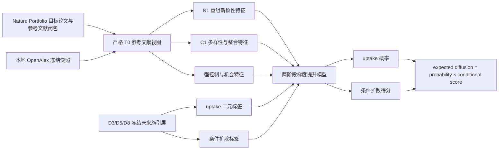

# ASPR v6 本地冻结实验：观察维度、指标、数据、标签、模型与 OOF 验证

> 文档状态：与 ASPR v6 最终冻结发布一致  
> 协议版本：`aspr-nature-v6-local-frozen-2026-07-23`  
> 最终发布产物：`sha256:1e32d6061b6080903e87f3b46de84527f9c7993ddcfb7b690226ac5d62d445be`  
> 数据策略：零联网、复用本地冻结原始资产，只创建带哈希和血缘的派生视图  
> 适用范围：Nature Portfolio 自然科学论文的发表时创新证据画像与发表后潜在学术影响预测

## 1. 技术摘要

本实验解决两个必须分开的任务：

1. **论文创新证据画像**：在论文发表时点，仅使用严格早于发表年的参考文献、
   来源组合和领域结构，观察论文知识基础的重组新颖性与多样性/整合程度。
2. **潜在学术影响预测**：利用发表时特征，预测论文在发表后 3、5、8 年内是否
   获得学术传播，以及在获得传播后，其未来施引者是否跨越更多领域、子领域和主题。

实验不把未来引用当作论文创新的标签。未来数据只用于潜在学术影响预测的结果变量。
因此，ASPR v6 的正确表述是：

> ASPR v6 输出一个 publication-time innovation-evidence profile，以及与其分离的
> future scholarly-influence forecast；它不输出创新真值、论文质量、社会影响或
> Nature 录用概率。

最终主预测模型实际使用：

- 2 个条件性重组新颖性特征；
- 4 个知识库多样性与整合特征；
- 5 个强控制特征；
- 不使用未来信息、作者声望、机构声望、未来引用数或未来网络结构作为输入。

D5 开发期 nested OOF Spearman 为 **0.7953**，强控制基线为 **0.7431**，
增益为 **0.0522**；唯一一次 2014–2017 封存检验 Spearman 为 **0.6484**，
相对基线增益为 **0.1908**。但消融结果显示，预测增益主要来自知识库多样性与
整合特征，而不是重组新颖性特征。因此，高 OOF 不能被反向解释为“模型已经验证了
创新真值”。

## 2. 实验的概念边界

### 2.1 三类对象不能混用

| 对象 | 作用 | 能否称为创新证据 | 是否进入最终主模型 |
|---|---|---:|---:|
| 创新观察指标 | 描述论文发表时知识基础的重组、多样性与整合 | 按注册角色限定 | 是，6 个 |
| 强控制变量 | 控制年份、领域、期刊族、参考文献规模和年龄 | 否 | 是，5 个 |
| 传播机会变量 | 描述论文在既有 bibliographic-coupling 网络中的可见位置 | 否 | 仅进入对照/消融 |
| 未来影响结果 | 描述 D3/D5/D8 的未来 uptake 与扩散 | 否，是标签 | 仅作结果 |

### 2.2 预测对象不是引用次数

主预测值 `expected_diffusion_score` 位于 `[0,1]`，表示：

```text
预测获得未来学术传播的概率
×
在获得传播条件下的预测跨领域扩散分位得分
```

它不是预期引用次数，也不能直接解释为“论文将获得多少次引用”。

## 3. 从本地数据到预测的完整流程



所有发表时特征满足：

```text
source_max_year < focal publication_year
```

同一年论文在全部完成评分后才加入历史计数，因而同年论文不会互相提供“历史”信息。

## 4. 使用的数据

### 4.1 冻结输入资产

| 资产 | 用途 | 当前处理 |
|---|---|---|
| Nature Portfolio v5 目标论文 | 论文 ID、年份、类型、venue、12 大类 | 必需 |
| Nature Portfolio v5 参考文献与参考闭包 | 论文参考列表、参考来源、年份、领域和引用关系 | 必需 |
| 冻结 D3/D5/D8 未来施引层 | uptake、未来领域/子领域/主题 reach 与 Simpson 指标 | 必需，仅作标签 |
| 本地 OpenAlex 快照 | 补齐参考文献来源、领域和严格历史图视图 | 必需，零联网 |
| 既有评审银标 | 辅助检查指标方向，不作训练标签或 gold validity | 可选、辅助 |
| 既有 landmark 资产 | 已知组验证候选 | 当前无充分重叠，不作确认依据 |

来源审计见
[`source_audit.json`](../outputs/nature_multihorizon_v6_local/source_audit.json)。
本地 OpenAlex 快照包含 2,128 个 works 分片，目录清单约 639 GB；本实验没有复制或
创建新的原始快照，只对选中的派生行和物化视图建立哈希。

### 4.2 论文范围

数据不是“只含 Nature 主刊”的样本，而是 **Nature Portfolio v5** 范围内的论文。
冻结共同窗口先得到 131,777 篇可观察到 D3/D5/D8 的目标论文，再限定为：

- 1980–2017 年发表；
- 自然科学 12 大类；
- 文献类型为 `article`；
- 未来请求成功或明确为 `zero_success`；
- D3、D5、D8 均有完整观察窗口，完整终点为 2025 年。

得到 118,059 篇候选自然科学 article，其中 118,057 篇进入共同主队列；另外 2 篇
因未来请求失败而排除。失败请求被视为缺失，绝不改写为零引用。

### 4.3 12 个自然科学大类

下表为共同 D5 主队列中的论文数；D3/D5/D8 使用相同论文集合。

| 领域 | 论文数 |
|---|---:|
| Life and molecular sciences | 38,853 |
| Clinical and health sciences | 23,927 |
| Earth, climate and environment | 11,605 |
| Engineering and energy | 9,833 |
| Materials and nanoscience | 8,815 |
| Physics | 7,553 |
| Neuroscience | 7,506 |
| Astronomy and space | 3,345 |
| Chemistry | 3,003 |
| Computer science and AI | 1,897 |
| Ecology, evolution and microbiology | 1,181 |
| Mathematics and statistics | 539 |
| **合计** | **118,057** |

### 4.4 参考文献与映射规模

| 数据项 | 数量或比例 |
|---|---:|
| 共同窗口目标论文 | 131,777 |
| 主自然科学 articles | 118,059 |
| 论文—参考文献边 | 3,452,616 |
| 去重参考文献元数据 | 3,421,132 |
| 12 大类映射覆盖率 | 99.43% |
| 未来施引 horizon 行 | 22,871,558 |
| 归一化唯一未来施引关系 | 11,275,012 |
| 最大返回施引者数 | 每篇 1,000 |

未来层原始质量报告因 5 个缺失 checkpoint 将 `overall_pass` 标记为 false。v6 没有
隐藏该事实，而是使用预先冻结的规则：

- 最多允许 5 个缺失 checkpoint；
- 未来抓取成功率必须不低于 0.99；
- 失败是缺失，不是零；
- 主自然科学 article 中实际只有 2 篇因此未进入主队列。

### 4.5 零引用论文和截顶

| 窗口 | 目标行 | 明确观察为零 | 正 uptake |
|---|---:|---:|---:|
| D3 | 118,059 | 24,478 | 93,579 |
| D5 | 118,059 | 22,680 | 95,377 |
| D8 | 118,059 | 21,344 | 96,713 |
| **合计** | **354,177** | **68,502** | **285,669** |

每个 horizon 的 118,059 行中还有 2 行未来请求失败，标签保持缺失；因此单个 horizon
的“明确零 + 正 uptake”为 118,057，而不是 118,059。

主队列没有删除零引用或低引用论文。施引者返回上限为 1,000，因此极高影响论文可能
发生截顶；队列内 cap-hit 比例为 D3 0.028%、D5 0.180%、D8 0.624%。cap-hit
论文没有按结果被删除，这一风险必须作为高端标签压缩的限制报告。

## 5. 创新证据观察角度

来源筛选是一个截至 2026-07-23 的
`targeted_scoping_evidence_map_not_systematic_review`，不是系统综述或元分析。
来源协议要求原始构念来源、论文级操作化、独立效度或批评性证据、稳定 DOI，以及
对不利或无效证据的保留。完整规则见
[`evidence_selection_protocol_v6.json`](../configs/evidence_selection_protocol_v6.json)。

### 5.1 N1：重组新颖性

**意义。** 观察论文参考知识来源之间是否形成历史上稀有、非典型或首次出现的组合。
这一角度接近“新知识重组”，因此在注册表中被标为 `direct_innovation`；但当前
OpenAlex 来源级适配和固定边际近似尚未完成与原始随机化方法的完全等价性验证，所以
整体状态是 `conditional`。

主要来源：

- [Uzzi et al. (2013)](https://doi.org/10.1126/science.1240474)；
- [Lee, Walsh & Wang (2015)](https://doi.org/10.1016/j.respol.2014.10.007)；
- [Wang, Veugelers & Stephan (2017)](https://doi.org/10.1016/j.respol.2017.06.006)；
- 独立效度与批评边界：
  [Bornmann et al. (2019)](https://doi.org/10.1016/j.joi.2019.100979)、
  [Fontana et al. (2020)](https://doi.org/10.1016/j.respol.2020.104063)。

| 指标 | 计算意义 | 当前实际用途 | 来源/等价性 |
|---|---|---|---|
| `novelty_u_t0_source` | 对焦点参考来源对的历史 commonness 取 10% 下分位并做负对数；越高表示下尾组合越罕见 | **最终主模型特征** | Lee 体系的严格 T0 来源级适配；零历史共现使用冻结的 0.5 smoothing |
| `uzzi_atypicality_p10_t0` | 来源对固定边际超几何 z 分数的负 10% 分位；越高表示非典型尾部越强 | **最终主模型特征** | Uzzi 体系的近似实现；保留完整二部图置换未完成的限制 |
| `first_time_source_pair_share` | 焦点参考来源对中，在严格历史中从未出现的比例 | 画像专用，不训练 | Wang 2017；条件性适配 |
| `first_time_source_pair_distance_mean` | 首次来源对之间的平均认知距离 | 注册为画像候选；**当前冻结视图未实际计算，值为缺失** | Wang 2017、Fontana 2020；等待来源距离实现 |
| `uzzi_conventionality_median_t0` | 来源对 z 分数中位数，描述论文是否建立在常规知识基础上 | 画像专用，不训练 | Uzzi 2013 |

`novelty_u_t0_source` 的核心形式为：

```text
commonness(i,j) = O_ij × N / (N_i × N_j)
U = -ln(Q_0.10(commonness))
```

其中 `O_ij`、`N_i`、`N_j` 和历史论文数 `N` 均只由焦点论文发表年前的 Nature
Portfolio 论文计算。当前历史对计数范围是 `prior_nature_portfolio_targets_only`，
不是全球科学文献全集，这也是 N1 必须保持条件性角色的原因之一。

### 5.2 C1：知识库多样性与整合

**意义。** 观察论文参考知识库覆盖了多少领域、这些领域是否均衡、领域之间是否
认知遥远，以及不同领域份额和距离共同形成的整合程度。

这一角度是“支持性创新上下文”，而不是直接新颖性。跨学科、多样或认知距离远，
不自动意味着论文提出了新理论或新发现。

主要来源：

- [Stirling (2007)](https://doi.org/10.1098/rsif.2007.0213)：variety、
  balance、disparity 的多维 diversity 框架；
- [Rafols & Meyer (2010)](https://doi.org/10.1007/s11192-009-0041-y)：
  论文级 diversity 与 knowledge integration/coherence；
- [Wang, Thijs & Glänzel (2015)](https://doi.org/10.1371/journal.pone.0127298)：
  三个成分不可互换；
- [Leydesdorff, Wagner & Bornmann (2019)](https://doi.org/10.1016/j.joi.2018.12.006)：
  引用分布与认知距离操作化；
- [Fontana et al. (2020)](https://doi.org/10.1016/j.respol.2020.104063)：
  新颖性与跨学科性相关但不等同。

| 指标 | 公式或定义 | 意义 | 当前实际用途 |
|---|---|---|---|
| `field_variety` | 被参考文献占用的领域类别数 `V` | 知识基础覆盖的领域数量 | **最终主模型特征；已晋级** |
| `field_pielou_evenness` | `-Σ p_k ln(p_k) / ln(V)`，仅在 `V>1` 定义 | 不同领域参考份额是否均衡 | **最终主模型特征；已晋级** |
| `field_disparity_cosine_mean` | 已占用领域对之间 `1-cosine(profile_k, profile_l)` 的平均值 | 被连接领域之间的认知距离 | **最终主模型特征；已晋级** |
| `rao_stirling_integration` | `Σ_k Σ_l p_k p_l d_kl` | 将领域份额和认知距离共同整合 | **最终主模型特征；已晋级** |

领域认知距离不是用未来数据计算。对每个焦点年份 `t`，系统只使用
`t-5` 至 `t-1` 年的领域—领域引用剖面，计算余弦距离。

原方案把 variety/balance 和 disparity/Rao 分为 C1、C2 两个确认性候选维度。
Stirling 的理论并不支持将其宣称为两个独立构念，开发期判别检查也没有显示原 C2
具有独立构念增量，因此在封存解锁前合并为一个维度。该修订：

- 没有增加或删除指标；
- 没有增加或删除论文；
- 没有改变公式、标签、模型门槛或结果窗口；
- 没有访问封存标签。

修订记录见
[`protocol_amendment_001_dimension_merge.json`](../outputs/nature_multihorizon_v6_local/protocol_amendment_001_dimension_merge.json)。

### 5.3 S1：结构变异

**意义。** 观察将焦点论文所连接的参考知识关系加入严格历史共引图后，是否造成
模块度、跨簇连接和中心性分布的明显变化。

来源：

- [Chen (2012)](https://doi.org/10.1002/asi.21694)；
- [Sebastian & Chen (2021)](https://doi.org/10.1371/journal.pone.0254744)。

| 指标 | 意义 | 当前用途 |
|---|---|---|
| `sva_modularity_change_rate` | 固定历史分区下的相对模块度变化 | 敏感性函数已实现，不进入主模型 |
| `sva_cluster_linkage` | 增强图相对基线图的跨簇连接变化 | 敏感性函数已实现，不进入主模型 |
| `sva_centrality_divergence` | 增强前后 betweenness 分布的 KL divergence | 敏感性函数已实现，不进入主模型 |

当前尚未通过 CiteSpace 等价性、图剪枝和分辨率稳定性门，因此 S1 不能被称为
确认性结构创新指标，也没有被实际加入最终训练特征。

### 5.4 N2：语义新颖性

**意义。** 观察焦点论文文本与严格早期论文文本之间的语义距离。

来源：

- [Shi & Evans (2023)](https://doi.org/10.1038/s41467-023-36741-4)；
- [Arts, Melluso & Veugelers (2025)](https://doi.org/10.1162/rest_a_01561)。

注册占位字段为 `semantic_prior_art_distance`。由于冻结主表缺少满足门槛的摘要覆盖、
冻结文本模型截止和人类编码效度，当前状态是 `exploratory/not_used`。系统没有用
标题距离静默替代摘要距离。

## 6. 指标的科学纳入与纳出规则

### 6.1 维度 D1–D7

一个观察维度要成为确认性候选，必须同时具备：

1. 可核查的奠基理论或方法来源；
2. 至少一个论文级 scientometric 操作化来源；
3. 至少两个数学上不同的发表时信号族；
4. 与控制、严谨性、可见度和未来结果有清晰边界；
5. 能由冻结本地数据计算，或明确标记为条件性；
6. 有独立效度研究、已知组证据或预注册效度检验；
7. 对应科学构念，而不是数据模态或预处理方式。

### 6.2 指标 I1–I10

每个进入主证据的指标必须：

1. 只映射到一个注册维度；
2. 有原始或公认数学来源；
3. 冻结公式、方向、参数、图层和时间窗口；
4. 最大信息时间严格早于发表年；
5. 注册图方向、权重、社区方法和零模型；
6. 明确缺失与结构未定义值，不能静默置零；
7. 可由冻结本地资产零联网计算；
8. 通过手算 toy-data 单元测试；
9. 如使用近似，须通过与精确实现的等价性门；
10. 在未来结果或封存结果被查看前注册。

### 6.3 运行时晋级 P1–P8

来源注册并不自动等于确认。运行时还必须通过实现、时间泄漏、覆盖、结果盲稳定性、
来源等价性、构念效度、领域/年代稳定性和版本封存纪律八类门。

本次只有：

- `C1_KNOWLEDGE_DIVERSITY`；
- `C1.VARIETY`；
- `C1.PIELOU`；
- `C1.DISPARITY`；
- `C1.RAO`

通过 P1–P8。N1 虽可作为条件性预测特征，但没有被伪装成已确认的创新测量；S1 和
N2 不进入最终模型。

## 7. 实际进入模型的其他特征

### 7.1 最终主模型的 5 个强控制特征

引用受年份、领域、期刊、参考文献数量和参考文献年龄影响，相关综述包括
[Bornmann & Daniel (2008)](https://doi.org/10.1108/00220410810844150) 和
[Tahamtan & Bornmann (2020)](https://doi.org/10.1007/s11192-019-03243-4)。
因此，创新特征必须与以下强基线比较。

| 特征 | 实际编码 | 意义 | 是否进入最终主模型 |
|---|---|---|---:|
| `publication_year` | 数值年份 | 控制引用制度、数据库覆盖和年代变化 | 是 |
| `domain12` | 类别 one-hot | 控制 12 大领域的引用与扩散差异 | 是 |
| `venue_family` | 类别 one-hot | 控制 Nature Portfolio venue family 差异 | 是 |
| `log_reference_count` | `ln(1+声明参考文献去重数)` | 控制参考文献规模和组合机会 | 是 |
| `reference_age_median` | `median(t - reference_year)` | 控制知识基础的新旧程度 | 是 |

因此，最终 `innovation_plus_controls` 一共使用 **11 个原始特征**：

```text
5 controls
+ 2 N1 conditional recombination features
+ 4 C1 diversity/integration features
```

数值缺失在每个训练折内使用中位数插补并增加 missing indicator；类别缺失填为
`missing`，随后 one-hot，未知类别忽略，最小类别频数为 10。

当前模型是树模型，没有执行 StandardScaler。配置中的“fold-local scaling”应理解为
任何需要从数据估计的变换都不得在全数据上拟合；当前实现没有需要拟合的数值缩放器。

### 7.2 机会变量：进入消融，不进入最终主模型

Bibliographic coupling 位置可能影响论文被哪些受众看到，但不证明论文更创新。
依据包括 [Biscaro & Giupponi (2014)](https://doi.org/10.1371/journal.pone.0099502)
和 [Guan et al. (2017)](https://doi.org/10.1016/j.joi.2017.02.007)。

| 特征 | 意义 | 实际用途 |
|---|---|---|
| `bc_degree_per_reference_t0` | 每个有效参考文献对应的严格历史共享参考邻居数 | opportunity-only 和联合消融 |
| `bc_shared_reference_strength_t0` | 与严格历史邻居共享参考文献次数总和 | opportunity-only 和联合消融 |
| `bc_component_share_t0` | 加入焦点节点后所在 coupling component 占历史论文的比例 | opportunity-only 和联合消融 |

这些特征同样按年份逐年计算；同年论文在全部评分后才加入历史图。

### 7.3 物化或注册但没有实际作为最终特征的字段

| 字段 | 状态 |
|---|---|
| `first_time_source_pair_share` | 画像专用 |
| `first_time_source_pair_distance_mean` | 当前物化为缺失，未训练 |
| `uzzi_conventionality_median_t0` | 画像专用 |
| `reference_age_iqr`、reference/source/field coverage、quality flags | 质量诊断或敏感性，不训练 |
| `prior_graph_degree_median` | 条件性 prior-popularity 敏感性，不进入强基线 |
| `bc_local_clustering_t0`、`bc_harmonic_closeness_t0` | 未请求精确全图计算，只作条件性占位 |
| 三个 S1 指标 | 函数已实现，未进入当前物化主特征和训练 |
| `semantic_prior_art_distance` | 未实现为冻结主特征 |
| 未来引用、未来领域扩散、未来网络结构 | 只作结果，绝不作 T0 特征 |

## 8. 标签如何定义

### 8.1 三个预测窗口

对发表年为 `t` 的论文：

- D3：观察 `t+1` 到 `t+3`；
- D5：观察 `t+1` 到 `t+5`；
- D8：观察 `t+1` 到 `t+8`。

2017 年是共同队列的最晚发表年，因为冻结未来层完整到 2025 年。

### 8.2 第一阶段标签：未来 uptake

```text
future_uptake = 1[n_future_citers > 0]
```

只有抓取成功或明确 `zero_success` 的请求才有这个标签：

- 成功且没有施引者：`future_uptake=0`；
- 成功且至少一个施引者：`future_uptake=1`；
- 请求失败或未知：缺失，不能写成 0。

这种两部分思想与零膨胀/两阶段计数模型传统一致，统计依据见
[Mullahy (1986)](https://doi.org/10.1016/0304-4076(86)90002-3)。

### 8.3 第二阶段标签：条件扩散 `rgpm_d_fold`

只对 `future_uptake=1` 且未来施引者 taxonomy 质量合格的论文构造条件扩散标签。
原始组件为：

1. 未来施引者覆盖的 distinct primary fields；
2. distinct subfields；
3. distinct topics；
4. future-citer field 分布的 Simpson diversity；
5. future-citer topic 分布的 Simpson diversity。

每个训练折内单独拟合标签参考分布：

```text
Breadth =
mean(
  train-reference percentile(log1p(field reach)),
  train-reference percentile(log1p(subfield reach)),
  train-reference percentile(log1p(topic reach))
)

Evenness =
mean(
  train-reference percentile(field Simpson),
  train-reference percentile(topic Simpson)
)

rgpm_d_fold = 0.5 × Breadth + 0.5 × Evenness
```

分位映射使用 mid-distribution percentile：

```text
0.5 × [F_train(x-) + F_train(x)]
```

测试折、封存集及其未来结果不参与参考分布拟合。

### 8.4 合并的实际结果标签

评估主排名时使用：

```text
realized_diffusion_target =
    0                 if future_uptake = 0
    rgpm_d_fold       if future_uptake = 1 and conditional target valid
    missing           if positive uptake but conditional taxonomy is invalid
```

因此：

- 分类器使用全部有有效 uptake 的主队列论文；
- 条件回归器只使用正 uptake 且条件标签完整的论文；
- 明确观察到的零完整保留，并在合并标签上取 0；
- taxonomy 不完整的正 uptake 论文保留在分类任务中，但不伪造扩散标签。

D5 开发期共有 69,785 篇论文，其中 49,568 篇进入条件回归训练池；
20,174 篇为观察零。D5 封存期有 48,272 篇论文，其中 2,506 篇为观察零；
合并排名标签有 48,270 个有限值。

## 9. 模型训练详情

### 9.1 两阶段模型

两个阶段使用相同的发表时特征集合，但拟合不同结果：

1. `HistGradientBoostingClassifier` 预测
   `P(future_uptake=1 | T0 features)`；
2. `HistGradientBoostingRegressor(loss="squared_error")` 预测
   `E(rgpm_d_fold | uptake=1, T0 features)`。

最终输出：

```text
expected_diffusion_score
= calibrated_uptake_probability
  × calibrated_conditional_diffusion
```

两个模型都设置：

- `early_stopping=False`；
- 固定随机种子；
- L2 regularization；
- 所有预处理只在当前训练折拟合。

### 9.2 冻结参数网格

| 参数 | compact | medium |
|---|---:|---:|
| `max_leaf_nodes` | 15 | 31 |
| `max_depth` | 3 | 4 |
| `min_samples_leaf` | 50 | 50 |
| `learning_rate` | 0.05 | 0.05 |
| `max_iter` | 150 | 200 |
| `l2_regularization` | 10 | 10 |

内层选择目标为：

```text
selection_objective
= Spearman(inner expected score, inner realized target)
  - 0.10 × inner uptake Brier score
```

如目标相同，优先选择更低复杂度。D5 的六个唯一模型在五个 outer folds 中均选择
`medium`。最终封存的 `controls_only` 和 `innovation_plus_controls` 也都使用
`medium`。

### 9.3 校准

校准只使用内层或开发期 OOF 预测：

- uptake 概率：Platt logistic calibration；
- 条件扩散：限制在 `[0,1]` 的 isotonic calibration；
- 如样本或预测唯一值不足，保守退回到裁剪后的原始预测。

概率预测的 proper scoring、calibration 和 sharpness 依据
[Gneiting & Raftery (2007)](https://doi.org/10.1198/016214506000001437) 和
[Gneiting, Balabdaoui & Raftery (2007)](https://doi.org/10.1111/j.1467-9868.2007.00587.x)。

### 9.4 90% conformal 区间

区间半径来自训练可用 OOF 绝对残差：

```text
q = quantile_higher(
      absolute residuals,
      ceil((n+1)×0.90)/n
    )
```

分别构造条件扩散区间和合并 realized-score 区间。封存残差不会反向更新区间。

## 10. Nested OOF 的详细计算策略

### 10.1 为什么采用 expanding-year OOF

随机 K-fold 会让较晚论文帮助预测较早论文，不符合真实部署顺序。v6 使用按年份扩展的
时间折，保证每个测试块只由更早年份训练：

```text
max(train publication year) < min(test publication year)
```

### 10.2 开发期与封存期

| 数据层 | 年份 | 论文数 | 用途 |
|---|---:|---:|---|
| 开发期 | 1980–2013 | 69,785 | nested OOF、参数选择、校准、消融 |
| 一次性封存期 | 2014–2017 | 48,272 | 最终 D5 时间外推 |

开发期最早的 16,678 篇论文只作为第一个 outer fold 的初始训练块，因此不会得到
outer-OOF 预测。最终 OOF 评价样本为 53,107 篇，而不是全部 69,785 篇。

### 10.3 外层五折

| Outer fold | 训练年份 | 测试年份 | 训练数 | 测试/OOF 数 |
|---:|---:|---:|---:|---:|
| 1 | 1980–1985 | 1986–1999 | 16,678 | 12,484 |
| 2 | 1980–1999 | 2000–2004 | 29,162 | 8,837 |
| 3 | 1980–2004 | 2005–2009 | 37,999 | 12,674 |
| 4 | 1980–2009 | 2010–2012 | 50,673 | 11,840 |
| 5 | 1980–2012 | 2013 | 62,513 | 7,272 |
| **合计 OOF** | — | 1986–2013 | — | **53,107** |

### 10.4 每个 outer fold 内部发生什么

对每个 outer training set 和每个模型：

1. 在 outer training 内再建立 4 个 expanding-year inner folds；
2. inner 初始训练比例为 25%；
3. 对 `compact`、`medium` 分别生成完整 inner OOF；
4. 用 `Spearman - 0.10×Brier` 选择参数；
5. 仅用被选参数的 inner OOF 拟合 Platt、isotonic 和 conformal 半径；
6. 在整个 outer training 上重新拟合分类器和条件回归器；
7. 对 outer test 只预测一次；
8. 拼接五个互不重叠的 outer test，形成最终 OOF 表。

代码会检查 `paper_id + model_id` 不得重复。

### 10.5 OOF 主指标

主排名指标为 pooled outer-OOF：

```text
Spearman(
  expected_diffusion_score,
  realized_diffusion_target
)
```

注意：每个 outer fold 的条件标签分位参考只来自该 fold 的训练数据，因此不同时间折
使用不同的训练参考分布。主指标将五折的 `[0,1]` 得分合并计算；同时单独报告每折
Spearman，避免 pooled 指标掩盖年代不稳定。

### 10.6 不确定性与基线比较

- Spearman 95% CI：2,000 次 paper-level bootstrap；
- 增益 CI：对同一论文的主模型与基线预测进行 2,000 次 paired bootstrap；
- 基线：相同 outer/inner 折、相同模型族，只使用 5 个强控制；
- 领域宏平均：先在每个领域算 Spearman，再对达到 `n>=200` 的领域等权平均；
- 校准：10 个等宽概率箱的 ECE、Brier 和相对训练期 prevalence 的 Brier skill；
- 区间：90% 覆盖和平均宽度。

固定随机种子为 `20260723`。

## 11. 预注册模型与消融

| 模型 | 特征组成 | 目的 |
|---|---|---|
| `controls_only` | 5 controls | 强基线 |
| `innovation_plus_controls` | 5 controls + 2 N1 + 4 C1 | 最终主模型 |
| `n1_recombination_plus_controls` | 5 controls + 2 N1 | N1 独立增量 |
| `c1_knowledge_diversity_plus_controls` | 5 controls + 4 C1 | C1 独立增量 |
| `opportunity_only_plus_controls` | 5 controls + 3 opportunity | 可见机会对照 |
| `innovation_plus_opportunity_plus_controls` | 主模型 + 3 opportunity | 检查机会变量是否解释创新特征增量 |

由于当前只有 N1、C1 两个实际进入预测的创新维度：

- leave-out C1 等同于 N1-only；
- leave-out N1 等同于 C1-only。

实现会识别这些别名，不重复拟合完全相同的特征集合。

## 12. 开发期 OOF 结果

### 12.1 D5 全部模型

| 模型 | OOF Spearman | 相对 controls 增益 | 增益 95% CI | 条件 Spearman | 领域宏平均 |
|---|---:|---:|---:|---:|---:|
| Controls only | 0.7431 | 0 | — | 0.5073 | 0.6682 |
| **Innovation + controls** | **0.7953** | **0.0522** | **0.0497–0.0547** | **0.6385** | **0.7373** |
| Opportunity + controls | 0.7438 | 0.0007 | -0.0003–0.0017 | 0.5100 | 0.6734 |
| Innovation + opportunity + controls | 0.7949 | 0.0518 | 0.0493–0.0543 | 0.6361 | 0.7373 |
| N1 + controls | 0.7564 | 0.0133 | 0.0119–0.0147 | 0.5404 | 0.6885 |
| C1 + controls | 0.7946 | 0.0515 | 0.0491–0.0539 | 0.6363 | 0.7359 |

关键解释：

- C1-only 几乎达到完整模型的性能，说明主要增量来自知识库多样性与整合；
- N1 有正增量，但明显较小；
- opportunity-only 的增量区间跨零；
- 把 opportunity 加入完整模型没有改善主排名；
- 因而不能把高 OOF 解释为“直接新颖性测量已被验证”。

### 12.2 D3/D5/D8 一致性

| 窗口 | OOF Spearman | 95% CI | 相对基线增益 | 增益 95% CI | ECE | Brier skill | 90% 区间覆盖 |
|---|---:|---:|---:|---:|---:|---:|---:|
| D3 | 0.7962 | 0.7926–0.7998 | 0.0454 | 0.0432–0.0477 | 0.0244 | 0.5968 | 0.9078 |
| D5 | 0.7953 | 0.7917–0.7987 | 0.0522 | 0.0497–0.0547 | 0.0204 | 0.5723 | 0.9063 |
| D8 | 0.7933 | 0.7896–0.7968 | 0.0553 | 0.0527–0.0578 | 0.0225 | 0.5442 | 0.9036 |

D5 是预注册主窗口，要求增益不低于 0.05。D3、D8 是方向一致性窗口，只要求正向
且置信区间支持正增益；D3 的 0.0454 不应被误写成通过 D5 的 0.05 主门槛。

### 12.3 D5 外层时间折

| 测试年份 | OOF 数 | 主模型 Spearman | 条件 Spearman |
|---|---:|---:|---:|
| 1986–1999 | 12,484 | 0.7874 | 0.6154 |
| 2000–2004 | 8,837 | 0.7649 | 0.6067 |
| 2005–2009 | 12,674 | 0.8172 | 0.6661 |
| 2010–2012 | 11,840 | 0.8072 | 0.6716 |
| 2013 | 7,272 | 0.7373 | 0.6331 |

最新开发折表现较总体低，但仍明显高于预注册时间外推门槛 0.30。

## 13. 唯一一次封存检验

### 13.1 封存纪律

在读取 2014–2017 结果标签前，系统已经锁定：

- 48,272 个论文 ID；
- `controls_only` 和 `innovation_plus_controls` 两个模型；
- 两个模型均使用 `medium` 参数；
- 在 1980–2013 全开发集上拟合的模型；
- 仅由开发 OOF 得到的校准器和 conformal 半径；
- 96,544 行预标签预测。

之后仅解锁一次，计数为 `1/1`，禁止重新解锁、调参或重选样本。

### 13.2 封存主结果

| 指标 | Controls | Innovation + controls |
|---|---:|---:|
| 论文数 | 48,272 | 48,272 |
| 有限合并标签 | 48,270 | 48,270 |
| Spearman | 0.4576 | **0.6484** |
| Spearman 95% CI | 0.4501–0.4652 | **0.6425–0.6546** |
| 条件 Spearman | 0.3701 | **0.5945** |
| 相对基线增益 | — | **0.1908** |
| 增益 95% CI | — | **0.1843–0.1972** |
| Brier skill | 0.7949 | 0.7940 |
| ECE | 0.0066 | 0.0071 |
| realized 90% coverage | 0.8755 | **0.9016** |
| realized interval width | 0.5969 | **0.5497** |

封存门 10/10 通过。主模型的 uptake Brier skill 略低于 controls，但仍显著为正；
其主要改善体现在扩散排名、条件扩散和区间宽度，而不是单纯 uptake 分类。

### 13.3 领域结果与限制

| 领域 | 开发 OOF Spearman | 封存 Spearman | 封存 n | 封存可报告 |
|---|---:|---:|---:|---:|
| Ecology/evolution/microbiology | 0.7598 | 0.5426 | 538 | 是 |
| Life/molecular | 0.7482 | 0.5746 | 15,299 | 是 |
| Neuroscience | 0.6235 | 0.5895 | 2,663 | 是 |
| Materials/nanoscience | 0.7522 | 0.5905 | 5,211 | 是 |
| Physics | 0.7811 | 0.6420 | 4,154 | 是 |
| Clinical/health | 0.7693 | 0.6439 | 7,640 | 是 |
| Engineering/energy | 0.8123 | 0.6445 | 5,235 | 是 |
| Computer science/AI | 0.7497 | 0.6454 | 747 | 是 |
| Earth/climate/environment | 0.7799 | 0.6455 | 4,737 | 是 |
| Chemistry | 0.8060 | 0.6916 | 1,255 | 是 |
| Mathematics/statistics | 0.5542 | 0.7541 | 143 | **否** |
| Astronomy/space | 0.7115 | 0.7973 | 650 | 是 |

数学统计领域开发期主模型相对 controls 的增益为 **-0.0066**，且封存样本只有
143 篇，低于预注册 `n>=200` 的单领域报告门。其封存相关系数只能作为描述值，不能
作为独立领域确认结论。

封存结果中的：

- 12 领域全包含宏平均为 0.6468，用于领域存在性/总体方向门；
- 按 `n>=200` 规则的 11 个可报告领域宏平均为 0.6371。

二者分母不同，报告时不得混用。

## 14. 构念、稳定性和实现质量检查

### 14.1 特征覆盖

118,059 篇主自然科学 article 的主特征有限值比例：

| 特征 | 有限值比例 |
|---|---:|
| `field_variety` | 1.0000 |
| `rao_stirling_integration` | 0.7583 |
| `novelty_u_t0_source` | 0.7486 |
| `uzzi_atypicality_p10_t0` | 0.7486 |
| `field_pielou_evenness` | 0.7307 |
| `field_disparity_cosine_mean` | 0.7060 |

主队列不要求所有特征有限，也不根据结果删除缺失论文。缺失只在训练折内插补并加
missing indicator。参考文献至少 10 条、元数据覆盖至少 0.60 的规则用于
measurement-complete 敏感性子集，不用于按结果缩小 uptake 主队列。

### 14.2 C1 结果盲参考文献子采样

对 4,988 篇论文、78 个“领域 × 五年”层进行 20 次 80% 参考文献子采样：

| 指标 | 最差重复 Spearman | 最大中位相对误差 | 门槛 |
|---|---:|---:|---:|
| Variety | 0.9329 | 0.0000 | rho≥0.90，误差≤0.10 |
| Pielou | 0.9382 | 0.0594 | 通过 |
| Disparity | 0.9600 | 0.0000 | 通过 |
| Rao–Stirling | 0.9652 | 0.0780 | 通过 |

C1 指标最大两两绝对 Spearman 为 0.6751，低于 0.90 冗余预警线。

### 14.3 评审银标

冻结评审银标仅匹配到 22 篇目标论文，最低标签置信度 0.35，低于预注册的 30 篇和
0.70 置信度门。因此只能检查方向，不能将 C1 或 N1 宣称为得到人类 gold label
确认。

### 14.4 实现测试

最终注册测试为 **40/40 通过**，覆盖：

- 注册表、来源与实现解析；
- 手算指标；
- 严格历史切断；
- 零引用保留；
- fold-local 标签转换；
- nested temporal OOF；
- 校准和 conformal；
- 构念稳定性；
- 单次封存和重解锁禁止；
- 最终发布清单自哈希。

## 15. 结果可以支持什么、不能支持什么

### 15.1 可以支持

- 这些发表时指标包含对未来 scholarly uptake/diffusion 有用的增量信息；
- 增量不是仅由年份、领域、venue、参考文献数量和年龄解释；
- 结果在 D3/D5/D8、五个开发时间折和大多数领域中方向稳定；
- C1 的四个指标具有来源、数学定义、结果盲稳定性和运行时晋级记录；
- 预测概率和区间具备可报告的校准与覆盖表现。

### 15.2 不能支持

- “ASPR 已测得每篇论文的真实创新程度”；
- “高分论文质量更高”；
- “引用或扩散就是创新”；
- “N1 已通过完全等价的确认性构念验证”；
- “所有领域都获得同样增益”；
- “该模型预测 Nature 是否录用”；
- “这些维度是唯一正确的创新分类”；
- 因相关预测结果而作因果解释。

## 16. 主要限制和下一步

1. **Nature Portfolio 选择偏差**：模型是在 Nature Portfolio 论文上训练和验证，
   不能未经外部验证推广到全部科学论文。
2. **N1 历史范围**：来源组合历史主要来自 prior Nature Portfolio targets，不是
   全球文献全集。
3. **N1 等价性未完成**：固定边际超几何近似尚缺完整度序列保持的二部图交换验证。
4. **人类效度不足**：22 篇低置信度银标不能替代独立盲评 gold set。
5. **S1/N2 未确认**：结构和文本角度仍缺冻结数据与来源等价性门。
6. **标签是项目定义的传播复合量**：`rgpm_d_fold` 有来源支持的 breadth/evenness
   思想，但 0.5/0.5 权重是预注册项目定义，不是文献直接规定。
7. **折间标签参考不同**：pooled OOF 使用每折训练参考得到的分位标签，因此必须与
   已报告的逐折结果共同解释。
8. **极高影响截顶**：每篇最多 1,000 个未来施引者，尤其影响 D8 高端尾部。
9. **数学统计样本小**：封存 n=143，暂不支持独立领域结论。

优先后续工作应是：新增独立盲评 gold construct set、完成 N1 精确置换等价性、
在非 Nature Portfolio 外部语料上做冻结外部验证，并在满足摘要覆盖和模型截止后
单独验证 N2；这些工作不能通过重复解锁现有封存集完成。

### 16.1 待回答的研究问题

1. 在非 Nature Portfolio 的冻结外部论文集合上，C1 的增量和校准能否保持？
2. 用完整度序列保持的二部图 edge-swap null 替代超几何近似后，N1 排名能否保持
   `rho>=0.95` 且中位相对误差不超过 0.05？
3. 独立领域专家的盲评 gold labels 是否支持 N1 为直接新颖性、C1 为支持性上下文
   的构念区分？
4. 使用固定开发期标签参考而不是 fold-specific 标签参考时，pooled OOF 排名是否
   保持，并与逐折结论一致？
5. 对 cap-hit 论文使用区间删失或截尾模型后，D8 高端扩散结果是否变化？
6. 项目定义的 breadth/evenness 0.5/0.5 权重对结论是否敏感？该分析只能在新的
   预注册开发协议中进行，不能借现有封存结果选权重。

## 17. 复现入口与冻结产物

### 17.1 关键代码

- 指标公式：
  [`features_v6.py`](../aspr/nature_multihorizon/features_v6.py)
- 严格 T0 物化：
  [`feature_materializer_v6.py`](../aspr/nature_multihorizon/feature_materializer_v6.py)
- 控制和机会特征：
  [`prediction_features_v6.py`](../aspr/nature_multihorizon/prediction_features_v6.py)
- fold-local 标签：
  [`targets_v6.py`](../aspr/nature_multihorizon/targets_v6.py)
- nested OOF、模型、校准和区间：
  [`modeling_v6.py`](../aspr/nature_multihorizon/modeling_v6.py)
- 封存逻辑：
  [`sealed_v6.py`](../aspr/nature_multihorizon/sealed_v6.py)
- 最终发布核验：
  [`finalize_v6.py`](../aspr/nature_multihorizon/finalize_v6.py)
- 命令入口：
  [`run_nature_v6_local.py`](../scripts/run_nature_v6_local.py)

### 17.2 注册表和协议

- 创新维度与指标：
  [`innovation_registry_v6_local.json`](../configs/innovation_registry_v6_local.json)
- 结果、控制和机会变量：
  [`prediction_registry_v6_local.json`](../configs/prediction_registry_v6_local.json)
- 来源纳入纳出：
  [`evidence_selection_protocol_v6.json`](../configs/evidence_selection_protocol_v6.json)
- 实验配置：
  [`v6_local.json`](../configs/nature_multihorizon/v6_local.json)

### 17.3 主要结果

- 构念稳定性：
  [`construct_validation_manifest.json`](../outputs/nature_multihorizon_v6_local/construct_validation_e4656f236bd2/construct_validation_manifest.json)
- D3：
  [`development_run_manifest.json`](../outputs/nature_multihorizon_v6_local/development_D3_1890a1060654/development_run_manifest.json)
- D5：
  [`development_run_manifest.json`](../outputs/nature_multihorizon_v6_local/development_D5_675206972abc/development_run_manifest.json)
- D8：
  [`development_run_manifest.json`](../outputs/nature_multihorizon_v6_local/development_D8_e8274531e230/development_run_manifest.json)
- 封存前晋级：
  [`promotion_report.json`](../outputs/nature_multihorizon_v6_local/release_candidate_f23973ca98ab/promotion_report.json)
- 唯一一次封存：
  [`sealed_evaluation_manifest.json`](../outputs/nature_multihorizon_v6_local/sealed_D5_cb8888f2ed23/sealed_evaluation_manifest.json)
- 最终冻结清单：
  [`final_release_manifest.json`](../outputs/nature_multihorizon_v6_local/final_release_manifest.json)

现有封存解锁已经消耗 `1/1`。在当前冻结工作区中不应再次运行或模拟封存解锁；
后续模型修改必须产生新的协议版本和新的外部验证数据，而不能复用该封存结果调参。

## 18. 参考文献

### 18.1 创新观察维度与指标

1. Uzzi B, Mukherjee S, Stringer M, Jones B. Atypical Combinations and
   Scientific Impact. *Science*. 2013.
   [doi:10.1126/science.1240474](https://doi.org/10.1126/science.1240474)
2. Lee Y-N, Walsh JP, Wang J. Creativity in scientific teams: Unpacking novelty
   and impact. *Research Policy*. 2015.
   [doi:10.1016/j.respol.2014.10.007](https://doi.org/10.1016/j.respol.2014.10.007)
3. Wang J, Veugelers R, Stephan P. Bias against novelty in science.
   *Research Policy*. 2017.
   [doi:10.1016/j.respol.2017.06.006](https://doi.org/10.1016/j.respol.2017.06.006)
4. Bornmann L et al. Do we measure novelty when we analyze unusual combinations
   of cited references? *Journal of Informetrics*. 2019.
   [doi:10.1016/j.joi.2019.100979](https://doi.org/10.1016/j.joi.2019.100979)
5. Fontana M, Iori M, Montobbio F, Sinatra R. New and atypical combinations:
   An assessment of novelty and interdisciplinarity. *Research Policy*. 2020.
   [doi:10.1016/j.respol.2020.104063](https://doi.org/10.1016/j.respol.2020.104063)
6. Stirling A. A general framework for analysing diversity in science,
   technology and society. 2007.
   [doi:10.1098/rsif.2007.0213](https://doi.org/10.1098/rsif.2007.0213)
7. Rafols I, Meyer M. Diversity and network coherence as indicators of
   interdisciplinarity. *Scientometrics*. 2010.
   [doi:10.1007/s11192-009-0041-y](https://doi.org/10.1007/s11192-009-0041-y)
8. Wang J, Thijs B, Glänzel W. Interdisciplinarity and Impact: Distinct Effects
   of Variety, Balance, and Disparity. *PLOS ONE*. 2015.
   [doi:10.1371/journal.pone.0127298](https://doi.org/10.1371/journal.pone.0127298)
9. Leydesdorff L, Wagner CS, Bornmann L. Interdisciplinarity as diversity in
   citation patterns among journals. *Journal of Informetrics*. 2019.
   [doi:10.1016/j.joi.2018.12.006](https://doi.org/10.1016/j.joi.2018.12.006)
10. Chen C. Predictive effects of structural variation on citation counts.
    *JASIST*. 2012.
    [doi:10.1002/asi.21694](https://doi.org/10.1002/asi.21694)
11. Sebastian Y, Chen C. The boundary-spanning mechanisms of Nobel Prize
    winning papers. *PLOS ONE*. 2021.
    [doi:10.1371/journal.pone.0254744](https://doi.org/10.1371/journal.pone.0254744)
12. Shi F, Evans J. Surprising combinations of research contents and contexts
    are related to impact. *Nature Communications*. 2023.
    [doi:10.1038/s41467-023-36741-4](https://doi.org/10.1038/s41467-023-36741-4)
13. Arts S, Melluso N, Veugelers R. Beyond Citations: Measuring Novel Scientific
    Ideas and their Impact in Publication Text. 2025.
    [doi:10.1162/rest_a_01561](https://doi.org/10.1162/rest_a_01561)

### 18.2 潜在影响、控制、机会变量与概率评估

14. Bornmann L, Daniel H-D. What do citation counts measure? A review of studies
    on citing behavior. *Journal of Documentation*. 2008.
    [doi:10.1108/00220410810844150](https://doi.org/10.1108/00220410810844150)
15. Tahamtan I, Bornmann L. What do citation counts measure? An updated review.
    *Scientometrics*. 2020.
    [doi:10.1007/s11192-019-03243-4](https://doi.org/10.1007/s11192-019-03243-4)
16. Mullahy J. Specification and testing of some modified count data models.
    *Journal of Econometrics*. 1986.
    [doi:10.1016/0304-4076(86)90002-3](https://doi.org/10.1016/0304-4076(86)90002-3)
17. Biscaro C, Giupponi C. Co-Authorship and Bibliographic Coupling Network
    Effects on Citations. *PLOS ONE*. 2014.
    [doi:10.1371/journal.pone.0099502](https://doi.org/10.1371/journal.pone.0099502)
18. Guan J, Yan Y, Zhang JJ. The impact of collaboration and knowledge networks
    on citations. *Journal of Informetrics*. 2017.
    [doi:10.1016/j.joi.2017.02.007](https://doi.org/10.1016/j.joi.2017.02.007)
19. Gneiting T, Raftery AE. Strictly Proper Scoring Rules, Prediction, and
    Estimation. *JASA*. 2007.
    [doi:10.1198/016214506000001437](https://doi.org/10.1198/016214506000001437)
20. Gneiting T, Balabdaoui F, Raftery AE. Probabilistic forecasts, calibration
    and sharpness. *JRSS B*. 2007.
    [doi:10.1111/j.1467-9868.2007.00587.x](https://doi.org/10.1111/j.1467-9868.2007.00587.x)
