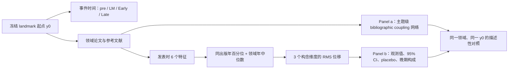

# Fig.1new：landmark 论文前后知识图谱与特征空间位移解读指南

> 适用对象：`outputs/fig01/new/figure_full_multivariate_shift.*`，版本
> `fig1-multivariate-shift-v8.3`。本文件解释最终保留的 Fig.1new；它不是
> 指标筛选流程本身的替代文档，也不描述已删除的 annual-line、strict7 或
> evidence154 图形变体。


## 1. 先用一句话理解这张图

Fig.1new 以四个已经冻结的 landmark 领域案例为单位，把两件在同一事件
时间轴上发生的事情放到一起看：左侧 Panel a 观察知识主题之间的文献耦合
网络如何重构；右侧 Panel b 观察论文级、发表时可计算的创新/潜在影响力
特征空间相对于 landmark 之前的偏移有多大、是否超出合理的历史或同期
对照波动，以及这种偏移主要来自哪个构念维度。

它想表达的是一个**描述性、机制导向的现象**：在若干高变化 landmark
案例中，主题耦合网络的重组与论文特征空间的变化可以同步被看见，但二者
并非总是同样强，也不能因此推出 landmark 论文“造成”了后续变化。

这张图不试图证明：

- landmark 论文对图谱或指标变化具有因果效应；
- 四个领域代表全部科学领域；
- 右侧的特征空间位移等于论文质量、未来引文或模型预测性能；
- 灰色 placebo 与蓝色 CI 构成正式显著性检验或因果识别。

## 2. 图形合同：它回答什么、单位是什么、最重要的边界是什么

| 项目 | Fig.1new 的定义 |
|---|---|
| 分析单位 | 围绕每个 landmark 起点排列的领域—年份论文集合 |
| 领域案例 | CRISPR–Cas（2012–13）、Graphene/2D（2004）、CuAAC click chemistry（2002）、GWAS（2007） |
| 左侧问题 | landmark 前后，论文之间的主题级 bibliographic-coupling 关系怎样变化？ |
| 右侧问题 | landmark 前后，发表时特征的**无方向总体位移**有多大，是否不同于 placebo，晚期位移由哪些维度构成？ |
| Panel a 时间语义 | 四个**累积**知识状态，而非四个互不相交的横截面 |
| Panel b 时间语义 | 相对 landmark 起点的阶段平均值与前 6 年基线的差异 |
| Panel b 单位 | 同出版年百分位的均方根偏移，换算为百分点（pp） |
| 统计不确定性 | 2,000 次按出版年分层的论文 bootstrap；显示 95% 百分位区间 |
| 可比性 | 四个领域共用 Panel b 的 0–30 pp 横轴；但案例不是随机抽样，比较应理解为描述性幅度比较 |

## 3. 从原始论文到图形：整体逻辑



两侧共享的是领域和 landmark 时间锚点，不共享同一个数学对象：Panel a 的
对象是论文之间的引用书目耦合关系，Panel b 的对象是单篇论文在六个
发表时特征上的位置。因此，Panel a 视觉变化很明显而 Panel b 变化普通，
或反过来，都是可能且有信息量的结果。

## 4. 为什么是这四个领域与四段时间

### 4.1 领域案例

四个显示案例来自冻结的 landmark 注册与领域筛选表
[`domain_selection.csv`](../../outputs/fig01/new/panel_data/domain_selection.csv)。
它们的共同点是拥有完整的局部论文窗口、可绘制的主题耦合图和可计算的
发表时特征；案例选择在当前 Panel b 的位移结果计算前冻结，规则明确禁止
根据年际指标效果、模型性能、未来引文或其他未来结果反向挑选案例。

这仍然是“为观察机制而选”的四个高变化案例，而非随机抽取的流行病学
样本。因此图中的领域之间可以比较图形模式，却不应被扩展为总体发生率或
普遍因果规律。

| 图中行 | landmark 起点 | Panel a 的前置基线 | 后续累积状态 |
|---|---:|---|---|
| CRISPR–Cas | 2012–13 | 2006–11 | through 2014、2017、2020 |
| Graphene / 2D | 2004 | 1998–03 | through 2006、2009、2012 |
| Click chemistry | 2002 | 1996–01 | through 2004、2007、2010 |
| GWAS | 2007 | 2001–06 | through 2009、2012、2015 |

### 4.2 四个阶段不是同一种窗口

| 图中名称 | 相对年份 | Panel a 的使用方式 | Panel b 的使用方式 |
|---|---|---|---|
| Pre | `t−6` 至 `t−1` | 第一个累积网络；基线 | 六个年度中位数的基线均值；因此位移定义为 0，不画条 |
| LM | `t0` 至 `t+2` | 在 pre 网络上累积加入 landmark 窗口论文 | 三个年度中位数的均值，与 Pre 比较 |
| Early | `t+3` 至 `t+5` | 继续累积加入下一组三年论文 | 三个年度中位数的均值，与 Pre 比较 |
| Late | `t+6` 至 `t+8` | 最终累积状态 | 三个年度中位数的均值，与 Pre 比较；额外显示维度构成 |

特别要注意：Panel a 第一帧是 6 年，后三帧分别在此前全部论文上继续累积
3 年；Panel b 则将每个阶段单独与 pre 基线比较。因而 Panel a 的 “through
t+5” 不是只看 `t+3:t+5` 的网络，而是看从 `t−6` 累积到 `t+5` 的网络。

## 5. Panel a：Topic-coupling transitions

### 5.1 Panel a 想回答什么

Panel a 用固定布局的小型主题网络展示一个领域的局部知识结构是否发生
重构：哪些主题始终相连，哪些耦合关系新出现或消失，landmark 所在主题
何时进入可见网络，以及后续论文集合如何累积扩展。

节点是归并到 OpenAlex primary topic 的论文群；边是主题群之间的
bibliographic coupling，使用余弦归一化的共享参考文献关系。最低共享参考
文献数设为 2。它反映“论文群引用背景的相似性”，不是引用方向、合作关系、
因果关系，也不是主题之间的语义距离。

### 5.2 如何按从左到右读一行

1. 先读纵向领域名与红色 `LM 年份`，确定该行的事件锚点。
2. 读最左的 `t−6 to t−1`，建立 landmark 发生前的知识结构基线。
3. 读第二格 `through t+2`。这里是 landmark 窗口结束后的第一个累积状态，
   因此顶部标题用橙色强调。
4. 再读 `through t+5` 与 `through t+8`，判断第二格出现的联系是否稳定、
   扩散、替换或消失。
5. 最后阅读卡片底部的 `n`、topic 数、`Δn` 和 `E +/−`，避免只凭视觉线条
   密度做判断。

### 5.3 Panel a 的每个视觉元素

| 图形元素 | 含义 | 正确解读 | 不应解读为 |
|---|---|---|---|
| 浅灰边框小卡 | 一个累积快照；顶部为实际年份范围 | 同一行四卡共享主题布局 | 相互独立的三年横截面 |
| 主题位置 | 同一主题跨四帧保持固定坐标 | 位置不动使边和节点变化可比较 | 二维坐标的精确语义空间距离 |
| 浅灰点状边 `union skeleton` | 任一快照曾存在的可显示耦合关系背景 | 用作跨帧比对参照 | 当前时点一定活跃的边 |
| 深灰实线 `retained` | 基线或相邻累积快照中持续存在的显示边 | 稳定耦合关系 | 不变的所有原始文献关系 |
| 橙色实线 `gained` | 相对前一快照新进入显示集的边 | 新出现的主题耦合 | landmark 导致的关系 |
| 洋红虚线 `lost` | 相对前一快照离开显示集的边 | 显示耦合被替换/消失 | 主题或论文永久消失 |
| 边的粗细 | 耦合强度的显示权重 | 较粗表示较强的显示关系 | 可与不同领域直接比较的绝对效应量 |
| 半透明彩色 halo | 一个主题群的论文量与视觉上下文 | 面积随该快照主题论文量放大 | 不同颜色对应不同“好坏” |
| 中心彩色小圆 | 主题身份；同一主题跨阶段颜色固定 | 追踪同一主题 | 单篇论文 |
| 橙色节点外圈 | 本快照中新激活的显示主题 | 主题在此快照首次进入显示网络 | 全领域中第一次出现该主题 |
| 红色星与红色外圈 | landmark-bearing topic | landmark 论文所在主题在 landmark 及以后状态被突出 | 该主题是唯一创新来源或因果中心 |
| halo 周围小 beads | 最多 5 篇真实、确定性选择的代表论文；红色 bead 为 landmark 论文 | 帮助读者看到主题簇由论文构成 | bead 数量等于主题全部论文数 |
| 细彩色 spokes | 将代表论文 beads 视觉连接到其主题 halo | 只是一种簇内归属提示 | 论文之间的引文边 |
| 主题文字与引线 | 优先标注 landmark 主题、其直接耦合邻居和高量级骨干主题 | 便于定性阅读 | 全部主题的无偏名单；`…` 表示文字截断 |
| 卡片底部 `n=` | 该累积快照中的论文数 | 样本量和累积规模 | 仅当前三年新增论文数 |
| 卡片底部 `topics` | 当前显示的活跃主题数 | 紧凑显示图中可见节点数 | 领域全部主题数 |
| `Δn +...` | 相比上一卡新加入的论文数 | 新增三年块的规模 | 节点或边的净增数 |
| `E +a/−b` | 相比上一卡新增/消失的**显示边**数 | 局部显示图的重连程度 | 原始全图中全部边的变化 |

### 5.4 为什么有些主题或边没有画出来

每张主图卡最多显示 8 个主题和 16 条活跃边，标签最多 3 个；这是为保持
四个累积网络可读而设的确定性显示上限。筛选和布局对四个时间点共享，
并非按某一阶段的“显著变化”临时挑选。完整的节点、边、标签审计数据保存在：

- [`snapshot_nodes.parquet`](../../outputs/fig01/new/panel_data/snapshot_nodes.parquet)
- [`snapshot_edges.parquet`](../../outputs/fig01/new/panel_data/snapshot_edges.parquet)
- [`transition_edges.parquet`](../../outputs/fig01/new/panel_data/transition_edges.parquet)
- [`snapshot_summary.csv`](../../outputs/fig01/new/panel_data/snapshot_summary.csv)
- [`topic_label_audit.csv`](../../outputs/fig01/new/panel_data/topic_label_audit.csv)

因此，Panel a 是可审计的紧凑视图，不是原始网络的完整可视化。

## 6. Panel b：Displacement and dimension contribution

### 6.1 Panel b 要解决的阅读难题

逐条画 6 个指标的折线容易产生“挑到变化最大的指标”的印象，也会把很多
不同单位的指标混在一起。Panel b 因而不再展示单个指标的方向性轨迹，而是
回答更稳定的问题：**在某一阶段，该领域论文的六维发表时特征向量离开
pre-landmark 基线有多远？**

它使用的是“分解式子弹—森林图”（decomposed bullet–forest）：一条 bar
给总体距离，一枚菱形及横线给观测值和不确定性，上方灰色 capsule 给出
placebo 背景，晚期 bar 再分解成构念组成。

### 6.2 右侧到底用了哪些特征和维度

完整 evidence-v3 注册中有 154 个来源可追溯的特征、48 个候选维度；本地
Fig.1 语料可物化 106 个。最终图不把 154 个全部混成一个分数，而是用一个
事先固定的小型核心：6 个 T0 特征，归为 3 个维度。这是**用于图形的稳健
多变量描述核心**，不能被误读为“完整研究最终只剩 3 个维度或 6 个指标”。

| 维度 ID / 图例颜色 | 图中名称 | 特征 | 权重与实现说明 |
|---|---|---|---|
| CD029 / 橙色 | Interdisciplinary integration | EF0017 Additive entropy diversity index | 该维度内唯一特征，权重 1。局部可复现实现为 `H_variety + H_balance − disparity`；明确标为 local surrogate，而非声称逐字复刻原始公式。 |
| CD031 / 紫色 | Knowledge diversity | EF0309 Rao–Stirling diversity；EF0312 Reference balance；EF0315 Reference disparity；EF0318 Reference variety | 4 个特征各权重 1/4。它们分别覆盖多样性、均衡性、认知距离和参考类别范围。四者作为一个维度整体再获得 1/3 的总权重。 |
| CD032 / 深蓝色 | Concept emergence | EF0240 New-concept birth metric | 该维度内唯一特征，权重 1。局部实现为当前题名中、此前年份语料从未出现过的词组（bigram）占比；不使用原指标依赖未来重度使用的条件。 |

三维度在总距离中各占 `1/3`。这个两层权重设计很关键：CD031 有 4 个特征，
但不会仅因特征数更多而自动压过 CD029 和 CD032。

选择规则是“可在发表时计算、属于直接创新或 T0 实质潜力、来自允许的
source-backed tier、在同一局部 source column 中取确定性代表”。它没有使用
图中观察到的变化幅度、未来影响、OOF 结果或模型性能来决定哪些特征入图。
其中 4 个是现有来源公式实现，2 个是透明披露的本地 operationalization
（EF0017、EF0240）。完整证据见
[`multivariate_feature_pool.csv`](../../outputs/fig01/new/panel_data/multivariate_feature_pool.csv)。

### 6.3 数学定义：图中“位移 pp”怎么得到

设论文 `i` 在特征 `f` 上的原始值为 `x_{i,f}`。首先在**同一出版年**内，把
每个特征转成百分位：

```text
p(i, f) = rank within publication year of x(i, f)
```

同一年、同一领域内取论文的中位数 `m(d, y, f)`。对 landmark 起点 `y0`：

```text
baseline(d, f) = mean_y∈{y0−6,…,y0−1} m(d, y, f)
stage(d, t, f) = mean_y∈stage(t) m(d, y, f)
delta(d, t, f) = stage(d, t, f) − baseline(d, f)
```

每个维度 `k` 的平方偏移为：

```text
q(d, t, k) = mean_f∈k [delta(d, t, f)^2]
```

总位移为：

```text
D(d, t) = 100 × sqrt(mean_k∈{CD029, CD031, CD032} q(d, t, k))
```

所以，`D=10 pp` 的含义是：在等权三维构念空间中，该阶段的领域年度中位数
向量相对 pre 基线发生了 10 个百分点的 RMS 偏移。它是**无方向的距离**：
10 pp 并不告诉你某个特征是升高还是降低；若需要方向，应回到完整特征表做
单独的、预先声明的分析。

### 6.4 Panel b 的每一处细节

| 图形元素 | 含义 | 如何读 | 常见误读 |
|---|---|---|---|
| 横轴 0、10、20、30 | 相对 pre 的总体位移（pp） | 条越长，特征空间离基线越远；所有领域共用横轴 | 不是未来影响力分数，也不是百分比增长率 |
| 左侧 LM / Early / Late | 三个 post-baseline 阶段 | 分别读 `t0:t+2`、`t+3:t+5`、`t+6:t+8` | LM 不是只指 landmark 论文发表当天 |
| 浅黄色 LM 背景 | 事件窗口视觉提示 | 强调第一段与 landmark 同期 | 不是显著性阴影，也不是处理组标签 |
| 浅蓝条（LM、Early） | 该阶段观测总体位移 `D` | 读右端位置和右侧数值 | 蓝条中的面积不是某个维度的份额 |
| Late 堆叠彩条 | Late 总位移的维度组成 | 三段总长度等于 Late 的 `D`；看各段比例 | 每一段不是独立的“百分点效应”，也不能把各维度 RMS 直接相加 |
| 段内百分比 | `q_k / Σq_k` 的平方位移份额 | 只在份额 ≥20% 且条宽 ≥2.5 pp 时标注，四舍五入 | 未标注不等于贡献为 0；可能只是太窄 |
| 白心深蓝菱形 | 观测到的 `D` | 菱形位置与右侧蓝字数值相同 | 不是均值论文或单个 landmark 的位置 |
| 深蓝横线与短端帽 | 95% bootstrap CI | 反映抽样重算后 `D` 的不确定性 | 不是因果效应 CI，也不是与 placebo 的显著性检验 |
| 灰色横向 capsule | placebo 的 5%–95% 区间 | 与菱形比较：若菱形明显高于灰段，说明该位移相对背景更不寻常 | 不是第二个实验组、也不是预测区间 |
| 灰色竖线 | placebo 中位数 | 作为典型背景位移 | 不是零点、不是阈值 |
| `observed · 95% CI` 图例 | 蓝色菱形与横线 | 解释主估计及不确定性 | 不表示同一颜色的 Late 维度 |
| 三种彩色图例 | CD029、CD031、CD032 | 只解读 Late 的构成 | 不应用来解释 LM/Early 的浅蓝条颜色 |

### 6.5 Bootstrap 和 placebo 分别解决什么问题

**Bootstrap**：在每个领域、每个出版年内对论文重抽样，先重算该年的特征
中位数，再重算阶段位移；共 2,000 次。它回答“在当前语料抽样不确定性下，
这个距离的范围是多少”。

**Placebo**：收集两类伪事件：

1. 同领域、与真实 landmark 相隔超过 8 年的历史伪起点；
2. 同期但在真实事件 15 年窗口内没有已知 landmark 的其他领域。

对每个伪事件按相同窗口、相同特征和相同公式计算 `D`，再画其 5%–95% 区间
和中位数。不同领域能形成的有效伪事件数不同，因此图表中的 placebo 样本数
为 7–17，不应把其视为均等规模的随机化试验。

## 7. 读出图中的实际结果

下表给出图上菱形的总体位移 `D`、其 95% bootstrap CI，以及 Late 阶段的
构成。单位均为 pp；括号中的区间为 bootstrap CI。

| 领域 | LM | Early | Late | Late 构成（CD029 / CD031 / CD032） |
|---|---:|---:|---:|---|
| CRISPR–Cas | 7.9 (5.1–12.9) | 5.3 (3.4–11.3) | 8.1 (5.3–11.9) | 1% / 85% / 14% |
| Graphene / 2D | 6.3 (3.7–12.0) | 8.9 (6.0–13.7) | 13.3 (9.9–17.3) | 31% / 28% / 41% |
| Click chemistry | 10.3 (7.0–17.8) | 25.7 (17.4–29.4) | 22.1 (18.2–25.4) | 12% / 83% / 5% |
| GWAS | 6.9 (5.1–9.8) | 11.8 (9.1–15.3) | 8.2 (6.1–11.7) | 7% / 81% / 11% |

结合灰色 placebo 后，更合适的描述性阅读是：

- **CRISPR–Cas**：Panel a 中主题连接发生明显重排，但 Panel b 的 LM、Early、
  Late 位移都落在或接近其 placebo 区间，且 Early 小于基线背景中位数。它是
  “图谱可见变化不必对应异常大的固定特征空间偏移”的清楚反例；不应表述为
  CRISPR 没有知识变化。
- **Graphene / 2D**：总体位移逐步增大，Late 为 13.3 pp，略高于其 placebo
  95% 上界 11.8 pp；Late 由三个维度较均衡地共同构成，概念涌现份额最大。
- **Click chemistry**：Early 25.7 pp、Late 22.1 pp，均远高于相应灰色背景
  区间，显示该固定特征空间出现强烈且持续的相对偏移；Late 主要由 CD031
  的知识多样性/整合潜力构成。
- **GWAS**：三个 post 阶段的菱形均高于相应 placebo 95% 上界，Early 最大；
  Late 偏移回落但仍高于背景。Late 同样以 CD031 为主。

这些句子都应使用“与 landmark 对齐”“相对背景更大/更小”“描述性偏移”
等措辞，而不要写成“landmark 造成”或“证明创新导致影响”。

## 8. 一个最稳妥的读图顺序

1. 选定一行，先看红色 `LM` 年份与四个网络时间框，确认 `y0`。
2. 从 Panel a 的 pre 网络开始，追踪红星主题、橙色新增边和洋红消失边。
3. 查看该行 Panel b 的 LM、Early、Late 条长，先比较总体位移，不急于看颜色。
4. 看蓝色菱形是否落在或高于灰色 placebo capsule，判断相对背景的异常程度。
5. 仅对 Late，再用彩色段解释哪一个构念贡献了较多的**平方位移份额**。
6. 若需精确数值、伪事件构成、未显示份额或所有 bootstrap draws，查 panel
   data 文件，而不要从图上反推。

## 9. 这张图对后续实验的可继承思路

Fig.1new 的价值不在于把一个单指标画得最显眼，而在于给后续实验提供一个
可迁移的三层框架：

1. **结构层**：用固定位置、累积时间窗的网络，观察领域知识结构的重连。
2. **构念层**：用来源可追溯、发表时可计算的特征，避免未来引用或训练标签
   泄漏回特征选择。
3. **稳健性层**：用共同横轴、year-stratified bootstrap 和历史/同期 placebo，
   将“看起来变化很大”拆成估计不确定性与背景波动两个问题。

后续要扩展到更多领域、更多 landmark 或模型训练时，建议保持以下原则：

- 在看结果之前冻结 landmark、时间窗、候选指标/维度和图形显示规则；
- 保持 Panel a 与 Panel b 共用相同 `y0`，但不要强迫它们一定同向变化；
- 将全量候选指标、可物化指标和图形核心指标分层保存，明确“模型特征集”
  与“图形解释核心”不是同一概念；
- 若换用不同主题体系、不同 bibliographic-coupling 阈值或不同时间窗，应将其
  作为预先定义的敏感性分析，比较整个图形合同而非只保留最好看的版本；
- 增加领域时优先报告所有注册案例或明示筛选流，而不是只追加变化最大的案例；
- 若把特征送入预测模型，必须在独立训练/测试方案中评估，不得用 Panel b 的
  post-landmark 幅度、图形美观度或未来结果来反向选特征。

## 10. 常见问题

### 为什么 Panel b 没有 Pre 条？

Pre 是所有后续阶段的参照均值，因此其位移按定义等于 0。画一根 0 长度条会
增加视觉噪声，信息已经由横轴零点表示。

### 为什么只给 Late 上色，而 LM 和 Early 都是浅蓝？

三阶段都可以计算维度贡献；但若每一条都堆叠三种颜色，读者会同时比较总量、
不确定性、placebo 和构成，信息过载。最终图将阶段比较留给 LM/Early 的单色
总量，将构念解释集中在具有较长期意义的 Late 阶段。原始贡献表保留了三个
post 阶段的完整数值。

### 彩色段的长度可以加起来吗？

在**图形长度**层面可以：Late 的彩色段被构造为 `D × contribution_share`，
所以刚好加成总条长。它们不能在统计意义上被称为三项独立的正/负 pp 效应；
真实维度 RMS 是平方、再平均、再开根的无方向量。

### CRISPR 的网络变化很明显，为什么 Panel b 不大？

因为 Panel a 观察主题关系的重连，Panel b 观察六个固定论文特征的相对位移；
它们的观测对象不同。这个差异本身正是图的科学价值：不要把“图谱重组”自动
等同于“所有创新/潜在影响力特征都异常移动”。

### 图中的 CI 或 placebo 能代替显著性结论吗？

不能。bootstrap 反映当前论文样本下的估计不确定性，placebo 提供描述性背景。
两者都没有处理未观测混杂、事件选择、领域共同趋势或多重比较问题。

## 11. 文件、复现与审计入口

| 用途 | 文件 |
|---|---|
| 最终图 | [`figure_full_multivariate_shift.png`](../../outputs/fig01/new/figure_full_multivariate_shift.png)、[`PDF`](../../outputs/fig01/new/figure_full_multivariate_shift.pdf)、[`SVG`](../../outputs/fig01/new/figure_full_multivariate_shift.svg) |
| 图形说明与最终流程 | [`experiments/fig01/new/README.md`](../../experiments/fig01/new/README.md) |
| 位移、bootstrap、placebo 计算 | [`multivariate_shift.py`](../../experiments/fig01/new/multivariate_shift.py) |
| 图形渲染与所有视觉编码 | [`multivariate_shift_render.py`](../../experiments/fig01/new/multivariate_shift_render.py) |
| 特征物化 | [`feature_materialization.py`](../../experiments/fig01/new/feature_materialization.py) |
| 最终特征池 | [`multivariate_feature_pool.csv`](../../outputs/fig01/new/panel_data/multivariate_feature_pool.csv) |
| 各阶段位移与 CI/placebo | [`multivariate_stage_displacement.csv`](../../outputs/fig01/new/panel_data/multivariate_stage_displacement.csv) |
| 所有阶段维度贡献 | [`multivariate_dimension_contributions.csv`](../../outputs/fig01/new/panel_data/multivariate_dimension_contributions.csv) |
| 伪事件逐条记录 | [`multivariate_placebos.csv`](../../outputs/fig01/new/panel_data/multivariate_placebos.csv) |
| 2,000-draw 位移结果 | [`multivariate_shift_bootstrap.parquet`](../../outputs/fig01/new/panel_data/multivariate_shift_bootstrap.parquet) |
| 可复现性与布局审计 | [`analysis manifest`](../../outputs/fig01/new/analysis_manifest_multivariate.json)、[`render manifest`](../../outputs/fig01/new/render_manifest_multivariate.json) |
| 图形测试 | [`tests/test_fig01_multivariate_shift.py`](../../tests/test_fig01_multivariate_shift.py) |

在仓库根目录运行：

```bash
python3 -m experiments.fig01.new.run_multivariate_shift
python3 -m unittest tests.test_fig01_multivariate_shift -v
```

测试会检查固定 6 特征/3 维度、等权规则、阶段和 CI 完整性、维度重构、
placebo 审计、最终 PNG/SVG/PDF 是否存在，以及 Panel a 左侧 55% 是否与冻结
像素基准逐像素一致。最终输出还保留了灰度和红绿色觉缺陷预览，以便检查
不依赖单一颜色的阅读能力。

## 12. 推荐的论文正文表述

可以写：

> Across four frozen landmark-field cases, topic-coupling networks showed
> visible reconfiguration, while a preregistered publication-time feature
> space displayed heterogeneous, descriptive displacement relative to both
> pre-landmark baselines and placebo events.

不要写：

> Landmark papers caused the observed feature-space changes.

前一句与图形设计和统计边界一致；后一句需要额外的因果识别设计才能成立。
