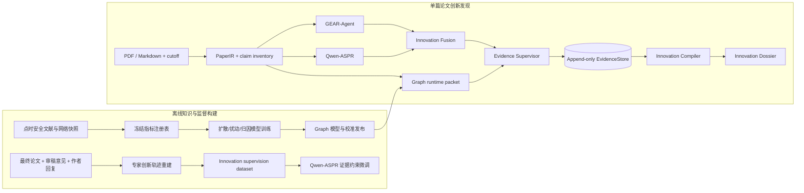
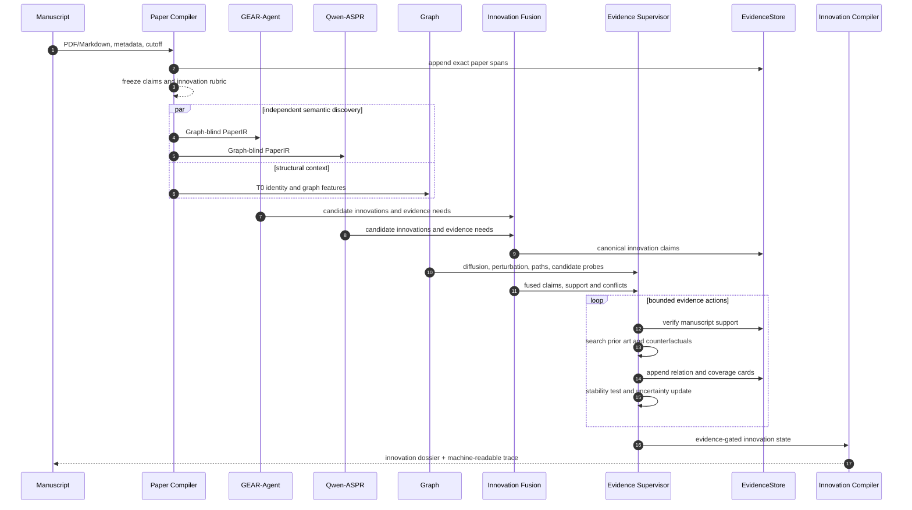

# GEAR：面向科学论文的证据驱动创新发现

**GEAR: Evidence-Grounded Discovery of Scientific Innovation from Scholarly Manuscripts**

> 稿件类型：Article / Methods paper 草稿
> 项目：ASPR-GEAR
> 作者、单位、通讯作者：**[待补]**
> 论文定位：科学论文创新发现、创新证据重建与知识结构影响分析

---

## 摘要

科学创新往往并不以一个可直接检索的标签出现。它可能表现为研究对象的重新定义、问题边界的迁移、机制链条的补全、方法组合的首次成立、结果外推范围的扩张，或一项工作对既有知识结构产生的新连接。仅依赖语义相似度容易把“表达相近”误判为“创新相同”，仅依赖引文网络又会把传播机会误当作实质原创性；通用语言模型虽然能够概括论文，却难以说明一项创新判断究竟来自稿件、既有文献、模型记忆还是影响力先验。文章创新发现因此不是单一的分类问题，而是一个需要同时重建论文论断、核验稿内支持、搜索先行工作、判断论断关系并估计结构影响的证据推理问题。

本文提出 GEAR，一种面向科学论文的证据驱动创新发现框架。系统首先将 PDF 或 Markdown 编译为带页码、字符偏移和内容哈希的 `PaperIR`，从中冻结论文级与论断级创新候选。GEAR-Agent 与完成证据约束微调的 Qwen-ASPR 在 Graph-blind 条件下独立分析同一论文，分别生成创新陈述、作用机制、边界条件、潜在先例与证据缺口；两路输出经 Innovation Fusion 对齐为 canonical innovation claims。Graph 模块则从发表时点可观测的科学计量、合作网络、参考文献组合和知识结构指标中学习未来扩散与结构扰动信号，并提供受限的检索候选和结构背景。融合后的创新候选进入有限状态证据监督器：系统逐项验证稿内证据、构造科学搜索框架、检索既有工作、提取成对全文证据、分类 `DIRECT`、`PARTIAL`、`EXTENSION`、`PARALLEL` 等关系，并通过反事实搜索与稳定性检查形成剩余创新度。

为训练 Qwen-ASPR 并建立专家监督，本文进一步构建审稿意见重建数据集。该数据集不把同行评议作为论文的最终任务，而把审稿意见视为高密度的专家创新信号：系统将最终论文、各轮审稿意见和作者回复重建为带来源引句、轮次、最终稿证据和解决状态的 issue traces，提取其中关于贡献边界、先例关系、机制缺口和证据充分性的判断。最终，GEAR 输出的不是一个不可解释的“创新分数”，而是一组可追溯的创新发现卡：每项创新对应稿件证据、先行工作关系、检索覆盖、剩余新颖性、潜在知识路径、结构影响及不确定性。该框架把文章创新发现从文本印象判断转化为可验证、可回放、可扩展的科学证据过程。

## 引言

发现一篇科学论文“新在哪里”，是文献理解、研究选题、科研评价和知识发现中的共同基础问题。研究者在阅读论文时通常需要同时回答多个层次的问题：作者声称了什么；哪些陈述真正得到实验或理论支持；相同研究对象是否已经被研究；相同机制是否已经被提出；方法组合是简单拼接还是产生了新的能力；论文的影响可能局限于一个局部主题，还是可能连接原本分离的知识区域。传统关键词检索、向量相似度、引文统计和大模型摘要分别覆盖其中一部分，却缺少统一的论断级证据结构。

创新发现的第一个难点是**分析单位错误**。论文整体相似并不意味着中心论断相同；两篇论文可能使用相同对象和数据，却解决不同问题，也可能使用不同术语表达同一机制。真正需要比较的是由研究对象、科学问题、机制、方法、结果和适用边界构成的论断结构。

第二个难点是**新颖性与影响力混淆**。一项工作可能高度原创但只服务于狭窄领域，也可能并不原创却凭借平台、规模或协作网络广泛传播。未来扩散、引文增长或图结构中心性可以描述知识传播潜力，却不能单独证明论文提出了新的科学关系。

第三个难点是**证据来源混淆**。模型可以生成看似合理的创新总结，但若无法回到论文原文和既有文献的成对证据，就无法区分真实发现、检索遗漏和模型联想。特别是“首次”“突破”“从未研究”等强结论，必须同时满足稿件有效、先例检索充分、关系判定稳定和时间边界合法。

本文的核心立意是：

> 科学论文创新发现不是从全文到标签或分数的映射，而是从论文论断出发，经由稿内证据、外部先例关系和知识结构路径逐步收缩不确定性的证据状态转换。

基于这一立意，ASPR-GEAR 将创新发现拆为四个协作模块：Graph 建立发表时点的知识结构表示；GEAR 执行从论文输入到创新证据报告的端到端推理；Qwen-ASPR 提供经专家轨迹微调的第二语义分析视角；审稿意见重建数据集从真实科研交流中恢复高质量创新监督。同行评议在本研究中是监督信号和输出应用之一，而不是方法的科学中心。

## 创新发现的形式化定义

### 论断是最小发现单元

对论文中的第 \(j\) 个核心论断，定义科学论断框架：

$$
c_j=(o_j,q_j,m_j,a_j,r_j,b_j),
$$

其中 \(o_j\) 为研究对象，\(q_j\) 为科学问题，\(m_j\) 为机制或解释链，\(a_j\) 为方法或干预，\(r_j\) 为结果，\(b_j\) 为适用边界。并非所有论文都会显式给出六个字段；缺失字段被保留为未知，而不是由模型补写。

创新发现的目标不是判断整篇论文“新/不新”，而是为每个 \(c_j\) 构建创新发现记录：

$$
\mathcal I_j=(M_j,\mathcal R_j,C_j,N_j,D_j,P_j,W_j,U_j),
$$

其中：

- \(M_j\)：稿件自身对论断的支持程度；
- \(\mathcal R_j\)：既有工作与该论断的关系集合；
- \(C_j\)：检索覆盖与证据充分性；
- \(N_j\)：证据门控后的剩余新颖性；
- \(D_j\)：未来知识扩散潜力；
- \(P_j\)：知识结构扰动潜力；
- \(W_j\)：论文论断到潜在知识路径的归因；
- \(U_j\)：综合不确定性。

这一表示把“论文怎么描述自己”“文献中是否存在先例”和“该创新可能扩散到哪里”分成不同变量，避免用一个总分替代科学解释。

### 创新的四个证据层

GEAR 将创新发现划分为四个依次收紧的层级：

1. **声明层**：作者提出了何种贡献或新颖性陈述。
2. **成立层**：该陈述是否有方法、结果或理论推导支持。
3. **关系层**：既有工作与该论断构成直接先例、部分先例、延伸、平行、支持还是冲突。
4. **结构层**：在论断成立且先例关系明确后，该工作可能如何改变知识扩散、边界连接和依赖路径。

创新发现只有同时保留这四层，才能区分“作者声称的新颖性”“外部证据支持的剩余新颖性”和“潜在结构影响”。

## 主要方法创新

### 论断级创新解剖

GEAR 不以论文摘要或全文 embedding 作为最终比较单元，而是建立包含对象、问题、机制、方法、结果和边界的 claim inventory。每个创新判断均可回到精确论文 span，并能与先行工作的对应 span 成对比较。

### 语义证据与 Graph 结构证据分权

文本分支负责提出创新候选、解析机制与识别边界；Graph 分支负责描述发表时点知识结构、潜在扩散和检索机会。Graph 不能直接证明新颖性，语言模型也不能把参数记忆当作文献证据。只有全文关系卡能够改变先例状态。

### 双模型独立分析与冲突保留

GEAR-Agent 与 Qwen-ASPR 在完全相同、Graph-blind 的论文输入上独立工作。两路结果不采用简单投票，而是在 claim level 记录支持、部分重合、冲突和独有发现。分歧成为后续检索与验证的优先对象，而不是被平均值掩盖。

### 有限状态证据推理

系统将创新发现实现为有预算、有动作集合、有失败语义的状态机。证据只能追加，预算只能消耗；缺失检索、Graph 或语义验证会产生显式不确定性，而不会被解释成“不创新”或“没有先例”。

### 从审稿过程重建创新监督

审稿意见、作者回复和最终稿记录了专家如何质疑贡献边界、指出先例、要求机制证据并确认修订。GEAR 将这一过程重建为 issue traces，用于训练 Qwen-ASPR 识别创新成立条件，而不是模仿接受或拒绝决定。

## 四模块总体架构



图 1｜四模块的训练与运行关系。Graph 学习知识结构，审稿重建数据集提供专家创新监督，GEAR-Agent 与 Qwen-ASPR 独立发现创新候选，Evidence Supervisor 通过外部证据确定剩余新颖性，Innovation Compiler 输出论断级创新档案。

两个语义分支及最终创新报告的关系为：

$$
Z_G=f_{\mathrm{GEAR\text{-}Agent}}(PaperIR,Rubric),\qquad
Z_Q=f_{\mathrm{Qwen\text{-}ASPR}}(PaperIR,Rubric),
$$

$$
\mathcal O=
\operatorname{Compile}\left(
\operatorname{Supervise}\left[
\operatorname{Fuse}(Z_G,Z_Q),G,E
\right]\right),
$$

其中 \(Z_G\) 和 \(Z_Q\) 是两组候选创新发现，\(G\) 是 Graph 结构信号，\(E\) 是追加式证据库，\(\mathcal O\) 是最终创新档案。融合发生在证据核验之前，因此任何分支的独有判断都必须经过同一外部证据流程。

| 模块 | 核心输入 | 核心输出 | 在创新发现中的角色 |
|---|---|---|---|
| Graph | T0 文献、引文、合作与参考结构 | 扩散、扰动、可靠性、路径与检索候选 | 描述知识结构位置与潜在扩散 |
| GEAR | 论文、截止日期、模型分支、检索服务 | 证据状态与创新档案 | 组织完整发现过程 |
| Qwen-ASPR | Graph-blind `PaperIR` 与量表 | 独立创新候选和证据需求 | 提供微调后的专家语义视角 |
| 审稿重建数据集 | 最终稿、审稿轮次、作者回复 | issue traces 与创新监督样本 | 为微调与方法校准提供专家轨迹 |

## 模块一：Graph——创新的知识结构背景

### Graph 不等于新颖性

Graph 模块回答的问题是：只观察论文出现时可用的信息，该工作位于怎样的知识结构位置，可能被哪些领域吸收，可能连接哪些原本分离的区域，并可能对既有依赖结构造成何种扰动。它不直接回答“论文是否首次提出某个论断”。

因此，Graph 的公开标量 `prospective_5y_diffusion_percentile` 只表示未来五年学术扩散的相对排序。它不是论文新颖性、科学正确性、重要性或录用概率。Graph 在创新发现中的作用受到三项约束：

1. Graph 分数不能创建创新论断；
2. Graph topology 只能提供待验证候选，不能成为先例证据；
3. 结构影响只有在稿件论断成立且先例关系完成核验后才能进入创新档案。

### T0 指标采集

所有特征必须在目标论文的知识截止时间 \(T_0\) 可观测。对于任意目标论文，历史统计、作者网络、参考组合、领域分布和文本新组合均只由严格早于 \(T_0\) 的记录构建。未来引用、未来共引、最终传播范围、审稿意见和创新标签不能作为输入。

指标候选按 Strict7、Primary16、Expanded153 和 Broad-T0-219 组织，并在模型训练前冻结。生产模型使用 Primary16：

| 结构角色 | ID | 指标含义 |
|---|---|---|
| 实质组合 | EF0017 | 参考领域 variety、balance 与 disparity 形成的加性熵多样性 |
| 实质组合 | EF0052 | 后向参考文献平均年龄 |
| 实质组合 | EF0240 | 标题二元词组相对严格历史语料的新出现比例 |
| T0 潜力 | EF0309 | Rao–Stirling 参考多样性 |
| T0 潜力 | EF0312 | 参考均衡度 \(1-\mathrm{Gini}\) |
| T0 潜力 | EF0315 | 参考领域平均差异度 |
| T0 潜力 | EF0318 | 参考领域数量 |
| 机会结构 | EF0083 | 既有作者团队图的平均聚类特征 |
| 机会结构 | EF0186 | 多国合作指示变量 |
| 机会结构 | EF0188 | 作者国家数量 |
| 机会结构 | EF0238 | 围绕焦点参考文献的书目耦合邻居数 |
| 机会结构 | EF0319 | 团队图相对代数连通度 \(\lambda_2/\lambda_{\max}\) |
| 上下文 | EF0038 | 作者数量 |
| 上下文 | EF0197 | 期刊或来源身份 |
| 上下文 | EF0307 | 发表年份 |
| 上下文 | EF0314 | 有效参考文献数量 |

机会结构与上下文变量即使具有预测力，也不能被解释为实质创新证据。它们描述的是传播条件和观测环境，而不是论断本身。

### 扩散目标与两部模型

Graph 将未来结果拆为“是否被知识系统吸收”和“被吸收后扩散多广”。令 \(U_i\) 表示论文 \(i\) 在设定窗口内是否发生有效 uptake；对正 uptake 论文，扩散目标由领域、子领域和主题覆盖 breadth，以及领域和主题分布 evenness 构成：

$$
B_i=\frac{1}{3}\sum_{k\in\{field,subfield,topic\}}
\operatorname{Pct}_{train}\left[\log(1+n_{ik})\right],
$$

$$
E_i=\frac{1}{2}\sum_{k\in\{field,topic\}}
\operatorname{Pct}_{train}\left[\operatorname{Simpson}_{ik}\right],
\qquad D_i^+=0.5B_i+0.5E_i.
$$

模型由 uptake 分类器和条件扩散回归器组成：

$$
\widehat D_i=
\operatorname{Cal}_U\!\left[\widehat P(U_i=1\mid x_i)\right]
\times
\operatorname{Cal}_D\!\left[\widehat E(D_i^+\mid U_i=1,x_i)\right].
$$

两部分均采用 HistGradientBoosting，并通过 nested expanding-time folds 完成参数选择、校准和区间构建。所有 target percentile references、imputation、calibration 和 residual intervals 只在训练时间折内拟合。最终模型、特征注册表、训练快照、时序折、校准器和 replay matrix 作为同一不可变发布进行哈希绑定。

### U–D–P–A–R 结构头

Graph runtime packet 将结构信息分解为：

- \(U\)：知识吸收概率；
- \(D\)：总体扩散或相对 field-year 基线的 excess diffusion；
- \(P\)：边界扩张、社区混合、依赖置换和路径缩短形成的结构扰动；
- \(A\)：Graph 信号到具体论文论断和知识路径的归因；
- \(R\)：由覆盖度、分布外程度、校准和区间宽度构成的可靠性。

Graph 信号按可靠性向 field-year 基线收缩：

$$
D_i^{shrunk}=D_{field,year}+R_i(D_i-D_{field,year}).
$$

缺失或无法回放的结构头不获得替代值。系统保留缺失字段并提高不确定性，避免把资产缺失误解释为低创新。

### Graph topology 作为发现探针

论文参考文献和点时安全图邻居可帮助发现术语不同但结构相关的先行工作。GEAR 保留普通论断级语义检索，并将 Graph topology 作为独立、受 cap 限制的候选池。一个 topology 候选只有在匹配科学框架中的多个字段、覆盖 essential facet、达到精确 claim alignment 并优于候选阈值时，才可进入全文验证。

即使候选来自论文的精确引文，它也必须完成 DOI 或保守标题解析、截止日期检查、全文 passage 提取和论断关系分类。图中的边只表示发现路径，不表示科学关系已经成立。

## 模块二：GEAR——从论文输入到创新档案

### 输入与 `PaperIR`

GEAR 接收 PDF 或 Markdown、论文元数据和知识截止日期。`PaperCompiler` 逐页解析文本，建立稳定页标记、段落、字符 offset 和内容 hash；`HybridPaperExtractor` 进一步提取：

- 论文中心问题与贡献陈述；
- novelty、method、causal、result、significance 和 scope claims；
- 方法台账与结果台账；
- 逐条参考文献及其 DOI、标题和年份；
- claim 到 paper span、method span 和 result span 的连接；
- 解析质量与缺失信息。

每个稿内证据具有 `P:S-*` 键。`PaperIR` 不是摘要，而是一份能回到原始页码和字符位置的论文证据图。

### 从页面到不可变证据跨度

GEAR 的第一步不是概括论文，而是建立不可变的证据坐标系。解析器按页读取 PDF，在保留页码、章节路径和字符 offset 的同时切分局部文本跨度，并对跨度正文及其位置身份计算内容 hash。稳定跨度标识可写为：

$$
s_k=\operatorname{SHA256}(
\text{document id},\text{page},\text{section path},
\text{start},\text{end},\text{text}
)_{1:20}.
$$

后续语义模型可以转述 span 的含义，却不能创建不存在的 span，也不能改变 span 指向的原文。原始证据仅追加到 `EvidenceStore`；Agent 状态只保存 `P:S-*` 引用。这样，即使后续查询、排序或关系判断发生改变，每个创新陈述仍可回放到同一页、同一字符区间和同一内容 hash。

解析器同时建立方法—结果台账，将正文跨度索引到 research question、dataset/sample、design/comparator、model/algorithm、baseline/metric/statistics、ablation/robustness、main result、limitation 以及 figure/table 等槽位。参考文献按条目解析，而不是把整个 bibliography 当作一个文本块；编号、标题、DOI 和年份用于之后的精确引文扩展与时间过滤。

### Claim 的确定性抽取

在任何开放式 Agent 推理之前，GEAR 先从非参考文献段落逐句构建可回放的 claim inventory。句子经空白规范化和大小写无关 hash 去重；过短、无法形成可检验命题的片段被排除。抽取器依据句内科学谓词将 claim 分成六类，并同时绑定最低证据要求：

| Claim 类型 | 识别的命题结构 | 必需的稿内证据 |
|---|---|---|
| `novelty` | first、novel、new、introduce 等优先权或差异陈述 | 目标 span + 待核验先例关系 |
| `method` | method、model、algorithm、framework、protocol 等技术陈述 | 目标 span + 方法实现证据 |
| `result` | improve、outperform、increase/decrease、显著性等结果陈述 | 目标 span + 结果、表格或统计证据 |
| `causal` | cause、lead to、mediate、drive 等因果陈述 | 目标 span + 因果设计证据 |
| `scope` | across、generalize、universally、broadly 等外推陈述 | 目标 span + 跨条件验证证据 |
| `significance` | important、transformative、promising 等重要性陈述 | 目标 span + 经校准的重要性依据 |

系统进一步识别 claim strength：包含 “first”“unprecedented”“demonstrates”“causes” 等强谓词的命题进入高风险验证队列；包含 “may”“could”“suggests”“preliminary” 等限定词的命题保留其弱模态；其余命题标为中等强度。强度不是质量分，而是证据动作的优先级。每个 claim ID 由规范化句子的 hash 生成，并继承原始 `span_id`、章节、claim type、strength 和 required evidence。若开放式语义抽取完全不可用，系统仍保留这一确定性 inventory，而不会用模型臆造的论断填补空缺。

### 受限语义补全与 claim 分面

确定性规则保证可复现性，但难以完整恢复隐含机制、跨句论断和领域同义词。因此 `HybridPaperExtractor` 在冻结 span 集合之上执行受限语义补全。模型只能输出原子 claim，并必须为每个 claim 提供已存在的主 span 和依赖 span；任何未知证据键、越界引用或无法映射到原文的命题都会被 schema gate 拒绝。语义抽取失败、返回空集合或违反约束时，系统回退到确定性 claims，并记录降级原因。

每个保留下来的 claim 被展开为科学分面：

$$
c_j=(o_j,q_j,m_j,x_j,y_j,b_j,\Delta_j,e_j),
$$

其中 $o_j$ 是研究对象，$q_j$ 是任务或问题，$m_j$ 是机制/方法，$x_j$ 是输入、人群或实验条件，$y_j$ 是结果/可观测量，$b_j$ 是比较器与适用边界，$\Delta_j$ 是作者声称的改变，$e_j$ 是稿内证据集合。系统据此构造 paper-specific innovation rubric：它规定该论文哪些中心命题值得进入创新发现、每个命题需要核验哪些 essential facets，以及什么证据能够使其成立或被限定。至此，“论文说了什么”与“这些说法是否新”被严格分开：前者由 PaperIR 冻结，后者留给后续检索与关系验证。

### 冻结创新候选

在调用 GEAR-Agent、Qwen-ASPR 或 Graph guidance 之前，系统先冻结 graph-blind claim inventory。每个候选包含 claim type、原文 span、方法/结果支持、centrality 和待验证 facets。Graph 不能增加、删除或改变论断 centrality，从而防止高影响先验反向塑造“论文新在哪里”。

### 完整发现流程



图 2｜GEAR 的端到端创新发现流程。GEAR-Agent 与 Qwen-ASPR 先独立发现候选，再融合；Graph 在融合后提供结构信息和候选探针；最终每项创新都必须经过证据监督。

| 阶段 | 处理 | 主要产物 |
|---|---|---|
| 论文编译 | PDF/Markdown 到精确 span 和 hash | `paper_ir.json` |
| 论断冻结 | 建立 claim inventory 与 innovation rubric | claim ledger |
| GEAR-Agent | 生成创新陈述、机制、边界和证据需求 | GEAR branch |
| Qwen-ASPR | 生成独立创新分析 | Qwen branch |
| Innovation Fusion | 对齐支持、部分重合、冲突与独有候选 | canonical claims |
| Graph 解析 | 计算扩散、扰动、可靠性、路径与候选探针 | Graph packet |
| 证据监督 | 稿内核验、检索、关系分类、覆盖和稳定性 | relation/coverage cards |
| 结构融合 | 形成剩余新颖性和结构创新 | innovation cards |
| 确定性编译 | 生成论断级创新档案与可读报告 | JSON/Markdown/manifest |

### GEAR-Agent：从 claim inventory 到可证伪创新假设

GEAR-Agent 的任务不是给论文打分，而是把中心 claims 转换成可以被检索、反驳和限定的创新假设。Agent 接收 Graph-blind `PaperIR` 与 paper-specific rubric；它看得到原文证据、方法—结果台账和参考文献，却看不到 Graph 分数，也不能把参数记忆当作先例证据。对每个中心 claim，Agent 执行以下变换：

$$
c_j\longrightarrow
h_j=(\text{changed object},\text{baseline},\text{mechanism},
\text{claimed delta},\text{boundary},\text{falsifier}).
$$

其中 falsifier 明确描述什么发现会推翻或收缩该创新，例如：截止日前存在同时覆盖对象、机制、结果和关键边界的论文；论文内部没有给出声称机制所需的实验；增益只能由已知比较器或数据差异解释。Agent 的输出必须是结构化 JSON，每个 major innovation point 必须携带真实 `P:S-*` 证据键；新颖性只能写成“需要外部验证的假设”，不能直接写成“此前从未有人做过”。若输出不满足 schema，系统进行一次基于真实 span 的证据键修复；再次失败则显式保留有限结果，而不是生成无证据结论。

GEAR-Agent 具体回答六个问题：论文改变了什么；改变由哪些稿件 span 支撑；它与什么传统对象、机制或任务形成比较；哪些先例家族最可能构成反例；哪些证据缺口会使创新不成立；若创新成立，它可能沿何种知识路径产生作用。由此得到的是 discovery hypothesis 和 evidence plan，而非编辑意见。

### GEAR-Agent 与 Qwen-ASPR 融合

两路输出被拆成原子 innovation points，并按 claim facets、稿件证据重叠、科学对象、机制和结果进行匹配。融合关系包括：

- `SAME`：两路识别到同一创新；
- `PARTIAL`：创新核心相同，但边界或机制不同；
- `CONTRADICTORY`：一方认为是实质创新，另一方认为是既有组合或证据不足；
- `GEAR_ONLY` / `QWEN_ONLY`：单一路径发现。

融合器不使用多数投票。`SAME` 提高候选优先级，`PARTIAL` 触发 facet 补全，`CONTRADICTORY` 触发反事实检索，独有候选进入同一证据验证队列。由此，Qwen-ASPR 的作用是增加发现空间和暴露分歧，而不是绕过证据门槛。

实现上，匹配仅在同一科学 aspect 内进行。候选相似性由文本词项重叠、精确 paper-span 重叠和重要性一致性共同构成，并执行一对一贪心匹配，避免一个宽泛的 Qwen point 同时“支持”多个不同的 GEAR claims。GEAR 分支先初始化 canonical points，Qwen 的同义或部分重合输出增加支持与补充分面，冲突输出写入 conflict 字段，Qwen 独有输出建立新的 canonical candidate。融合发生在外部检索之前，因此所有单路或双路候选都接受完全相同的先例审计。

### 从创新假设到检索目标

Evidence Supervisor 首先将 canonical innovation point 映射回冻结 claim 与精确 target span，形成 `RetrievalClaim`。这里禁止直接用一段宽泛的“本文很创新”摘要搜索，因为它容易召回主题相近却命题不同的论文。检索目标由以下信息共同约束：

- claim 原句及其强度、类型和 essential facets；
- 最多四个摘要、引言或背景上下文 spans；
- 最多四个方法 spans 与三个结果 spans；
- 目标 span 中出现的精确编号引文；
- 对应参考文献条目的标题、DOI、年份与原始文本；
- 方法—结果台账中与 claim 相连的比较器、指标和限制条件。

目标 span 中的精确引文由确定性解析器优先加入 citation seeds，而不交给模型猜测。语义规划器随后把这些材料压缩成 `ScientificSearchFrame`：target object、task/problem、mechanism、population/input、outcome/observable、comparator、author terms、legacy terms、brand terms、claimed delta、source spans 和 citation seeds。所有 source span 与 reference ID 必须存在于 PaperIR；规划结果若包含评审套话、未知引用或空泛概念会被拒绝。规划模型不可用时，系统由标题、claim、target span、关键词和精确引文构建确定性 fallback frame。

### 多意图查询规划

同一科学贡献常可用作者术语、历史术语、任务描述或机制描述表达。GEAR 因而不会依赖单一 query，而是从同一 `ScientificSearchFrame` 生成四种互补的普通查询：

1. **作者术语查询**：保留论文自身的核心术语，寻找显式同名工作；
2. **对象—问题查询**：围绕研究对象与待解决问题，跨越方法命名差异；
3. **机制—结果查询**：围绕作用机制与可观测结果，寻找科学上等价的实现；
4. **科学目的语义查询**：组合对象、任务、机制、人群/输入、结果和 claimed delta，寻找措辞不同但目的相同的工作。

词法查询被压缩为不超过六个非停用词的科学锚点，至少包含两个有效术语；语义查询保留完整命题结构，但限制长度，避免把整篇摘要当作查询。高风险 novelty claim 或两分支冲突还会生成 contrastive query：删除作者品牌词和新造名称，用 legacy terms、传统任务词或替代机制重写同一问题。其目标不是再次确认作者叙事，而是主动搜索“若这一创新并不新，旧文献会如何命名它”。每个 `QuerySpec` 都保存稳定 query ID、query family、role、search mode、source spans、anchor fields 和 transformation，使候选能够追溯到发现它的具体检索意图。

### 多源召回与候选联合

普通词法检索、语义检索、目标 span 的精确引文、contrastive search 与受限 Graph topology probes 构成相互独立的候选入口。Graph seeds 具有单独预算，不能挤掉普通 claim-level semantic queries；精确引文也必须经过 DOI 或保守标题解析，不能因“作者引用过”而自动成为先例。

每个来源返回的记录被规范化为 `RetrievedWork`，至少包含可解析的 work identity、标题以及全文、摘要或引文上下文之一。只有严格早于知识截止日期的论文才可参与先例判断；仅有年份时，只有来源年份小于截止年份才被保守接纳。缺少证据正文的 metadata-only 记录和时间不合格记录仍进入审计轨迹，但不会进入科学关系分类。

同一工作可能被多个查询召回。GEAR 按 work identity 去重，保留全部 source query IDs，并用 reciprocal-rank fusion 合并不同检索器的排序：

$$
s_{\mathrm{RRF}}(w)=
\sum_{q\in Q(w)}\frac{1}{60+\operatorname{rank}_q(w)}.
$$

这一设计奖励被不同检索意图独立发现的候选，而不要求不同提供方的原始分数可比。候选联合默认最多保留 120 项，随后进入本地科学重排；检索台账为每项候选记录 metadata-only、temporal-excluded、recall-filtered、rerank-filtered 或 compared 等选择阶段。

### 双视角、两阶段科学重排序

主题接近不等于能够比较某一 claim。GEAR 为每个目标构造两个互补的 query views：

- **whole-paper view**：论文标题与搜索框架所引用的上下文、方法和结果 spans，用于保持整项研究的语境；
- **scientific-purpose view**：target object、task/problem、mechanism、outcome 与 claimed delta，用于聚焦当前待核验命题。

第一阶段使用 BGE-M3 对候选标题与摘要编码。两个 query views 分别检索高召回集合，再取二者的并集，避免只符合局部机制或只符合全局主题的候选过早丢失。第二阶段使用 OpenScholar cross-encoder 对 `[query view, candidate document]` 成对评分；两个视角分别取 top-$k$ 后再次求并集，最终以双视角中的较强相关分排序：

$$
s_{\mathrm{rank}}(w)=
\max\{s_{\mathrm{whole}}(w),s_{\mathrm{purpose}}(w)\}.
$$

默认流程从候选联合中进行最多 100 项的 embedding recall，形成不超过 24 项的重排池，两个视角各保留前 15 项，再将不超过 10 项送入深入比较；同一候选家族设置上限，避免某个高度重复的研究系列占满证据预算。模型客户端延迟初始化；当本地 BGE-M3 或 OpenScholar 不可用时，系统依次退化到受 schema 约束的全局排序和确定性 token-overlap 排序，并在 coverage card 中记录实际 ranker 与降级信息。

### 语义可比性门与 Graph 候选准入

重排后的前 24 项并不会直接成为先例。`SemanticCandidateGate` 将精确 claim/span、ScientificSearchFrame 与候选标题、摘要、主题和关键词并置，逐项输出 `comparable`、`partial` 或 `distant`，同时列出 matched fields、essential facets、claim alignment 和理由。一个候选只有覆盖同一科学问题的关键分面，才值得消耗全文验证预算。

普通语义检索排名靠前的候选构成受保护的 baseline pool。Graph seed 或精确引文若要进入该池，必须被判为 comparable/partial，匹配至少两个科学字段，覆盖至少一个 essential facet，claim alignment 不低于 0.65，并以明确余量优于 baseline cutoff；加入时只能替换尾部候选，不能扩大总预算。该安全准入规则使 Graph 能发现词汇不相似的结构邻居，又不能凭图距离或期刊地位劫持新颖性判断。

### 全文 passage 提取与成对关系判断

进入 comparison pool 后，GEAR 获取候选全文，并以目标 claim 与科学框架为条件选择一至三个最相关 passages，而不是把整篇论文交给关系分类器。每个 prior passage 记录 work ID、页/段位置、文本 hash、检索来源和 evidence level；在全文不可得时可以使用摘要或引文上下文，但证据等级会限制能够作出的关系强度。

关系分类器必须同时看到 target paper span 与 prior-art passage，输出共同维度、差异维度、覆盖的 essential facets、时间合法性和关系标签。标签集合为 `DIRECT_ANTECEDENT`、`PARTIAL_ANTECEDENT`、`EXTENSION`、`PARALLEL`、`SUPPORT`、`CONFLICT`、`DISTANT` 和 `UNRESOLVED`。相似度分数本身不能产生 antecedent：`DIRECT_ANTECEDENT` 要求对象、问题、机制、结果及全部 essential facets 被截止日前的同一工作覆盖，并须经过独立复核；部分覆盖只能限定 residual novelty，不能把“相似”升级为“已做过”。`DISTANT` 和 `UNRESOLVED` 仅保留为审计证据。

关系结果以 `R:*` card 追加到 EvidenceStore，其中包含成对 spans、relation、facet coverage、commonality、difference、verification route 和 uncertainty。由此，“为什么这篇旧论文构成先例/延伸/平行工作”不再是模型的一句判断，而是一组可检查的双边证据。

### 反事实检索、覆盖审计与稳定性检验

对于含有 first/unprecedented 等强优先权词、major novelty、GEAR—Qwen 冲突或初步找到直接先例的候选，Supervisor 自动执行 counterfactual search。它以 legacy term、替代机制、上位任务和去品牌表达重新检索，并可沿精确引文或 Graph topology 做一次有上限的 citation expansion。若新增查询仍反复得到相同关系，结论稳定性提高；若新查询暴露新的候选家族，则重新进入排序、passage 提取与关系分类，而不是在首个看似相关的结果处停止。

每个 claim 的 `CoverageCard` 至少记录：完成的普通 query roles、contrastive query 状态、检索与时间合格数量、唯一候选数、实际比较 work IDs、whole-paper 与 purpose 两个排序视角、全文可得性、ranker、截止日期、降级原因和未覆盖区域。覆盖充分要求四类普通查询中至少三类完成、两个排序视角均完成、候选与实际比较数量达到预设最低规模，且服务没有失败。即使在该范围内没有找到直接先例，系统也只能形成“在已审计范围内未发现直接先例”的有界判断，不能声称全球首次。

### GEAR-Agent 的有限动作策略

完整 Agent 循环可概括为：

```text
INPUT: manuscript, metadata, knowledge cutoff
1  compile manuscript -> immutable PaperIR and append P:S evidence
2  extract deterministic claims; enrich only against existing spans
3  build method/result ledgers, claim facets and paper-specific rubric
4  freeze graph-blind claim inventory
5  run GEAR-Agent and fine-tuned Qwen-ASPR independently
6  atomize and one-to-one fuse innovation points; expose conflicts
7  for each canonical point, VERIFY_POINT against manuscript evidence
8  build ScientificSearchFrame and four-role normal query plan
9  SEARCH_PRIOR_ART; normalize, cutoff-filter, deduplicate and RRF-fuse
10 add exact citations and safely admitted Graph probes
11 BGE-M3 dual-view recall -> OpenScholar dual-view reranking
12 apply semantic comparability gate and family/budget caps
13 fetch full text; select 1--3 claim-relevant prior passages
14 classify paired target/prior relations and append R:* cards
15 if high-risk, conflicted or unstable: COUNTERFACTUAL_SEARCH
16 if topology/citation path is useful: bounded CITATION_EXPAND
17 audit query, candidate, ranking and comparison coverage -> COV:*
18 STABILITY_TEST across independent works/query roles
19 update residual novelty, manuscript validity and uncertainty
20 fuse admissible Graph diffusion/perturbation/pathway attribution
21 FINALIZE InnovationCards, dossier and machine-readable trace
OUTPUT: evidence-traceable scientific innovation dossier
```

动作不是任意规划。默认优先级是稿内核验、普通先例检索、必要时的引文扩展、高风险命题的反事实检索、独立稳定性检验，最后才是编译。每次动作必须消耗明确预算并追加可定位证据；预算耗尽时，未解决的 major points 不会被润色成结论，而是从最终断言中移除或收缩为待检验问题。

### Evidence Supervisor 状态机

令创新发现状态为：

$$
S_t=(\mathcal P,\mathcal C,\mathcal E_t,\mathcal R_t,\mathcal B_t,\mathcal T_t,\mathcal U_t),
$$

其中 \(\mathcal P\) 是冻结论文表示，\(\mathcal C\) 是融合创新候选，\(\mathcal E_t\) 是追加式证据，\(\mathcal R_t\) 是关系与覆盖状态，\(\mathcal B_t\) 是剩余预算，\(\mathcal T_t\) 是动作轨迹，\(\mathcal U_t\) 是不确定性。动作集合为：

$$
\mathcal A=\{
\texttt{VERIFY\_POINT},
\texttt{SEARCH\_PRIOR\_ART},
\texttt{CITATION\_EXPAND},
\texttt{COUNTERFACTUAL\_SEARCH},
\texttt{STABILITY\_TEST},
\texttt{FINALIZE}
\}.
$$

状态转移满足：

$$
\mathcal E_t\subseteq\mathcal E_{t+1},\qquad
\mathcal B_{t+1}\leq\mathcal B_t.
$$

证据只能追加，检索与验证预算只能减少。系统在预算耗尽、结论稳定或证据不足时终止，并在创新卡中保留未解决的不确定性。

### 先例关系分类

对候选论文 \(w\) 与目标 claim \(c_j\)，系统提取目标 span 和候选 span，判断：

| 关系 | 科学含义 | 对创新发现的影响 |
|---|---|---|
| `DIRECT_ANTECEDENT` | 关键对象、机制、结果和 essential facets 已被完整覆盖 | 对应 residual novelty 归零 |
| `PARTIAL_ANTECEDENT` | 覆盖核心的一部分，但缺少关键机制、结果或边界 | 限定创新范围 |
| `EXTENSION` | 在已知关系上增加新的条件、尺度、机制或能力 | 保留增量创新 |
| `PARALLEL` | 目标或方法相似，但科学路径不同 | 构成邻近而非先例 |
| `SUPPORT` | 提供机制或现象支持 | 增强成立性，不证明原创 |
| `CONFLICT` | 对目标论断形成反证或边界冲突 | 降低成立性或限定适用域 |
| `DISTANT` | 表面相似但关键 facets 不同 | 只保留审计记录 |
| `UNRESOLVED` | 全文或身份不足，无法稳定分类 | 提高不确定性 |

语义相似度本身不能产生 `DIRECT_ANTECEDENT`。直接先例要求时间合法、work identity 明确、共同维度与差异维度均被记录，并通过独立稳定性检查。

### 创新门控与结构融合

对 claim \(j\)，定义证据门控的新颖性：

$$
N_j=M_j\,C_j\,(1-\pi_j)\,\rho_j^{nov},
$$

其中 \(M_j\) 是稿件成立性，\(C_j\) 是检索覆盖，\(\pi_j\) 是由先例关系集合导出的先例风险，\(\rho_j^{nov}\) 是关系分类后的剩余新颖性。只有 \(N_j\) 确立后，Graph 扩散和扰动才进入结构创新：

$$
I_j=N_j^\alpha
[\epsilon+(1-\epsilon)D_j]^\beta
[\epsilon+(1-\epsilon)P_j]^\eta
V_{j,mech}^{\gamma}.
$$

其中 \(V_{j,mech}\) 表示机制链条的稿内有效性；所有指数非负且 \(\beta>0\)。完整直接先例使 \(N_j=0\)，因此高扩散潜力不能补偿实质先例。若扰动头不可用，对应因子被省略而不是填入中性伪值。

### 最终创新档案

GEAR 为每个中心论断生成 `InnovationCard`，包含：

1. **创新陈述**：对象、问题、机制、方法、结果与边界；
2. **稿件成立证据**：精确 `P:S-*` spans；
3. **先行工作地图**：`R:*` relation cards 和成对全文证据；
4. **覆盖说明**：`COV:*`、查询家族、数据库与未覆盖区域；
5. **剩余新颖性**：直接、部分、延伸或仍不确定；
6. **结构路径**：扩散、扰动、claim attribution 和 pathway；
7. **限制条件**：可能使创新不成立的证据缺口；
8. **不确定性**：解析、检索、关系判断和 Graph 可靠性。

`StructuredReview` 中的贡献摘要、新颖性、优点、弱点和作者问题是这一创新档案的人类可读表面，而不是研究任务本身。系统不输出接受/拒绝或编辑评分。

## 模块三：Qwen-ASPR——面向创新发现的证据约束微调

### 模型定位

Qwen-ASPR 是完成领域微调的独立创新分析模型。它不接收 GEAR-Agent 输出、Graph 分数或最终参考答案，只接收与 GEAR-Agent 同构的 Graph-blind `PaperIR`、claim inventory 和 innovation rubric。该隔离保证两路分析具有真实互补性。

Qwen-ASPR 采用两阶段训练：

1. 基于重建创新轨迹的 evidence-grounded supervised fine-tuning；
2. 面向证据权限错误的 innovation-evidence critic 训练。

模型通过延迟初始化的 OpenAI-compatible endpoint 接入 GEAR，模型发布、tokenizer、训练数据 release、超参数、随机种子和权重 hash 由训练 manifest 共同绑定。

### 训练样本

对论文 \(i\)，输入为：

$$
x_i=\operatorname{Serialize}(PaperIR_i,ClaimInventory_i,Rubric_i,Policy_i),
$$

目标为：

$$
y_i=\operatorname{InnovationAnalysis}(
\text{persisting and partially resolved expert issues}
).
$$

审稿人原句与作者回复只用于构造和验证 \(y_i\)，不进入 \(x_i\)。输入中不包含 Graph、GEAR-Agent 输出、编辑决定或目标评论文本。数据按论文 ID、DOI、标题、全文 hash 和近重复聚类进行去重；同一投稿的所有轮次固定在同一 split。

### 证据约束 SFT

模型学习生成严格结构化的 innovation analysis：

$$
\mathcal L_{SFT}
=-\sum_t m_t\log p_\theta(y_{it}\mid x_i,y_{i,<t}),
$$

其中结构字段、claim facets、证据键、关系假设、边界和创新文本均由训练 mask 控制。所有训练目标在进入训练前通过相同 schema gate：

- 每个创新点必须原子化；
- 每个关键点必须具有稿件证据；
- 新颖性只能作为外部核验假设；
- 作者回复不能创造创新点；
- 已完全解决或不可验证问题不能作为最终缺陷；
- 禁止 Graph 泄漏和编辑决定。

### 证据 critic

第二阶段从合法目标构造单因素负样本，包括：

- 替换为不存在的 paper span；
- 删除关键证据；
- 把作者回复当作专家意见；
- 把 `PARTIAL` 夸大为 `DIRECT`；
- 把高扩散描述成高新颖性；
- 合并多个不同创新；
- 插入录用决定或期刊评分；
- 把已解决问题重新写成最终缺陷。

令 \(y_i^+\) 为合法创新分析，\(y_i^-\) 为受控破坏版本，critic 采用成对排序目标：

$$
\mathcal L_{rank}
=-\log\sigma[
s_\phi(x_i,y_i^+)-s_\phi(x_i,y_i^-)
].
$$

该阶段使 Qwen-ASPR 学习的是“什么样的创新判断拥有合法证据”，而不是学习更积极或更严格的审稿风格。

### 与 GEAR-Agent 的融合

Qwen-ASPR 输出与 GEAR-Agent 输出在 `InnovationFusion` 中统一为：

```text
CandidateInnovation
  - claim_id
  - object / problem / mechanism / method / result / boundary
  - manuscript_evidence_keys
  - novelty_hypothesis
  - proposed_prior_art_queries
  - uncertainty
  - source_branch
```

融合器对两个分支进行 facet-level 匹配，并保留来源和冲突。Qwen-ASPR 独有候选不会直接进入最终报告，而是进入 Evidence Supervisor；只有获得稿内支持并完成必要外部关系验证后，才成为最终创新发现。最终输出因此是“Qwen-ASPR 扩展候选空间 + GEAR 统一证据裁决”，而不是两个模型文本的拼接。

## 模块四：审稿意见重建数据集——从专家交流中恢复创新轨迹

### 数据集的科学角色

同行评议不是本研究的目标任务，而是创新发现最密集的专家过程数据之一。审稿人会指出贡献是否被夸大、哪些工作构成先例、机制证据是否充分、方法组合是否真正新增能力，以及结论边界是否成立；作者回复和最终稿则记录这些判断如何被解决。

直接把原始审稿报告作为训练目标会产生时间错位：一个问题可能针对旧稿提出，却已在最终稿中解决。重建数据集因此以 issue trace 为单位，将专家问题与最终论文状态连接起来。

### 原始材料

每篇论文包含：

- 最终论文全文；
- 按 reviewer 和 round 分离的审稿报告；
- 与审稿意见对应的作者回复；
- 可选的修订说明和版本标识。

解析器确定性地区分 `reviewer_report`、`author_response` 和 `editorial` spans。审稿人身份只保存稳定匿名 hash，编辑决定不进入创新监督。

### Issue trace

每条轨迹包含：

```json
{
  "issue_id": "...",
  "reviewer_quote_keys": ["reviewer-span"],
  "reviewer_hashes": ["anonymous-hash"],
  "round_ids": ["round-1"],
  "author_response_keys": ["optional-author-span"],
  "final_paper_evidence_keys": ["P:S-..."],
  "innovation_facets": ["mechanism", "boundary"],
  "resolution_state": "persists | partially_resolved | resolved | unverifiable",
  "target_innovation_id": "optional"
}
```

状态定义为：

| 状态 | 含义 | 在创新监督中的用途 |
|---|---|---|
| `persists` | 专家指出的问题在最终稿中仍存在 | 形成创新边界或证据缺口 |
| `partially_resolved` | 修订解决部分问题，但核心限制仍存在 | 形成带边界的创新目标 |
| `resolved` | 最终稿已充分解决 | 用于学习修订与成立条件，不作为最终缺陷 |
| `unverifiable` | 无法由最终稿或合法材料确认 | 只保留审计，不进入监督目标 |

作者回复可以改变 resolution state，但不能单独创造 issue。每个保留目标必须同时拥有 reviewer quote 和最终稿 `P:S-*` evidence。

### 从审稿问题到创新监督

重建会话将 issue traces 转换为以下训练对象：

- 论文实际贡献与作者自我声明之间的差异；
- 创新成立所需的方法或结果证据；
- 审稿人提出的先例及其可验证查询；
- 直接先例、部分先例和增量延伸的边界；
- 机制、适用域和外推范围的限制；
- 修订后仍然成立的创新陈述；
- 能够转化为作者问题或未来研究方向的未知项。

这一数据结构使 Qwen-ASPR 学习专家如何分解创新，而不是学习最终录用意见。

### 隔离、质量门与发布

每篇论文使用一个隔离 reconstruction package。package 只包含最终论文 spans、审稿 excerpts 和作者回复 excerpts，不包含 Graph、GEAR 输出或其他重建答案。响应必须通过：

- package、prompt、schema、input 和 output hash 一致性；
- reviewer、author 和 editor 角色完整性；
- round 与匿名 reviewer 映射；
- final-paper evidence 有效性；
- resolution 与 target 对应关系；
- 决策语言和 Graph 泄漏检查；
- 重复 point 和跨论文近重复检查。

发布以 `paper_id` 为连接键，包含 `reference_structured_reviews.jsonl`、issue ledger、source manifests 和 hash-bound metadata。数据在论文层面划分训练、验证、时间外和领域外集合，任何同源版本、审稿轮次或文本改写都不能跨集合。

## 四模块之间的关系

### 训练链

审稿重建数据集从真实专家交流中恢复创新论断、证据需求与边界，并训练 Qwen-ASPR。训练完成后，Qwen-ASPR 只消费待分析论文，不访问该论文的参考审稿答案。

### Graph 链

文献与网络快照独立产生 T0 指标，训练扩散、扰动、归因和可靠性模型。Graph 不使用审稿标签，也不使用 GEAR-Agent 或 Qwen-ASPR 的文本输出训练扩散头。

### 运行链

GEAR-Agent 与 Qwen-ASPR 从同一 `PaperIR` 独立发现候选；Innovation Fusion 形成 canonical claims；Graph 提供结构背景与候选探针；Evidence Supervisor 完成先例关系、覆盖和稳定性验证；Innovation Compiler 生成最终档案。

### 信息防火墙

| 信息 | GEAR-Agent | Qwen-ASPR | Graph | Evidence Supervisor |
|---|---:|---:|---:|---:|
| 论文 `PaperIR` | 可见 | 可见 | 仅身份与冻结 claims | 可见 |
| Graph 分数与结构头 | 不可见 | 不可见 | 产生 | 可见但无证据权限 |
| 另一语义分支输出 | 不可见 | 不可见 | 不可见 | 融合后可见 |
| 审稿重建参考答案 | 不可见 | 仅离线训练 | 不可见 | 不可见 |
| 外部全文证据 | 不可直接裁决 | 不可直接裁决 | 只提供候选 | 可验证并写入证据库 |

这种分工使四个模块形成互补关系：数据集提供专家监督，Qwen-ASPR 扩展语义发现，Graph 描述知识结构，GEAR 负责证据裁决与结果组织。

## 创新发现的输出形式

### 论文级创新地图

系统将 claim-level InnovationCards 聚合为论文级 InnovationMap：

- 核心创新论断及其中心性；
- 每项创新的成立证据与限制；
- 与已有工作的直接、部分、延伸和平行关系；
- 未覆盖的检索区域；
- 可能受影响的知识主题、领域和路径；
- 结构扩散与扰动的可靠性区间；
- 论断之间的依赖关系；
- 可供研究者继续验证的问题。

论文级聚合只使用冻结 claim centrality，并对最核心论断采用 noisy-OR。Graph 不能提高一个未被文本分支识别的论断权重。

### 面向不同使用场景的表面

相同创新档案可以被确定性编译为不同但不改变证据的呈现：

1. **研究者模式**：贡献边界、先例地图和未来研究问题；
2. **文献综述模式**：目标论文与相关工作之间的关系矩阵；
3. **科研情报模式**：潜在扩散路径和跨领域连接；
4. **作者自检模式**：创新陈述与实际证据之间的缺口；
5. **同行评议模式**：贡献、新颖性、优点、弱点和作者问题。

同行评议只是第五种显示方式。所有表面共享相同 EvidenceStore、relation cards 和 InnovationCards，因而不会因任务表述不同而改变科学证据。

## 可复现性与失败闭合

单次运行持久化：

| 文件 | 内容 |
|---|---|
| `paper_ir.json` | 页、span、论断、方法、结果、参考文献与 hash |
| `agent_review.json` | GEAR-Agent 原始创新候选 |
| `qwen_review.json` | Qwen-ASPR 原始创新候选 |
| `graph_prior.json` | 扩散、扰动、归因、可靠性与拓扑探针 |
| `fusion_report.json` | 分支支持、冲突和 canonical claims |
| `review_state.json` | 证据状态、预算与动作轨迹 |
| InnovationCards | 论断级创新证据档案 |
| `review.json` / `review.md` | 当前人类可读输出表面 |
| validation / trace / manifest | 代码、配置、输入、prompt、状态与输出 hash |

缺失 Graph、检索、Qwen 或语义验证不会产生虚构替代。系统保留可完成的部分，并将受影响字段标记为 `inconclusive` 或 `limited`；论文解析无法形成最低限度 `PaperIR` 时终止。验证失败后的自动修复仅允许删除不合格 point 并重新编译，不能让生成模型自由改写证据。

主要复现入口为：

```bash
python3 -m gear validate-assets

python3 -m gear review \
  --paper /absolute/path/paper.pdf \
  --cutoff YYYY-MM-DD \
  --metadata /absolute/path/metadata.json \
  --output-dir outputs/gear/runs/example

python3 -m gear validate-run outputs/gear/runs/example
```

## 讨论

GEAR 将文章创新发现从“寻找看起来不同的文本”转化为“解释论断如何改变既有知识”。这一变化带来三个方法论含义。

第一，创新必须以科学关系为单位。一个新术语、一个高相似段落或一个罕见引用组合都不能独立证明创新；只有对象、问题、机制、结果和边界之间的关系发生可验证变化时，创新才具有科学含义。

第二，新颖性与结构影响必须分开。新颖性依赖稿件成立和先例关系，结构影响依赖论文在知识系统中的传播和重组潜力。GEAR 先确定 \(N_j\)，再计算 \(I_j\)，从数学上阻止高扩散预测覆盖直接先例。

第三，专家过程数据的价值不在于训练模型模仿结论，而在于恢复判断路径。审稿意见重建数据集记录专家如何提出先例、要求证据、限定边界并观察修订，使 Qwen-ASPR 学到创新成立的条件。模型输出随后仍需 GEAR 的统一证据监督。

这一框架可用于大规模文献地图、研究前沿发现、技术侦察、基金项目背景分析、作者创新自检和同行评议辅助。无论使用场景如何变化，系统都应保留“稿件证据—先行工作—关系判断—结构路径”的完整链条。

## 局限性

**创新仍然依赖领域知识。** 对复杂理论、实验范式或隐含假设的关系判定，自动系统可能无法替代领域专家。GEAR 的作用是暴露证据和分歧，而不是消除科学判断。

**检索不存在全局完备性。** 数据库覆盖、全文可用性、语言差异和历史术语会造成遗漏。系统只能给出“在已审计范围内”的结论。

**Graph 预测不是价值判断。** 扩散与结构扰动受领域规模、开放获取、合作网络和数据库偏差影响，不能替代科学正确性或社会价值。

**时间漂移需要持续审计。** 学科结构、发表行为和索引覆盖都会变化。冻结模型保证点时安全，却不能自动保证跨时期稳定。

**专家监督具有选择偏差。** 可获得完整审稿轮次和作者回复的论文不能代表全部科研活动，尤其可能低估未发表工作和非英语研究。

**双模型会增加候选也会增加冲突。** Qwen-ASPR 与 GEAR-Agent 的互补性必须通过统一证据监督约束，否则候选扩张可能转化为更多未经验证的创新陈述。

## 伦理与治理

未公开论文可能包含敏感或保密内容。部署时必须明确模型 endpoint、数据驻留、日志保留和外部检索策略；API 密钥只保存在环境变量中。审稿材料的使用必须遵守期刊、作者和审稿人的许可，匿名 reviewer hash 不能被视为绝对匿名。

Graph 中的国家、来源和合作变量只用于结构建模，不得被解释为研究者能力或论文价值。系统不应根据作者身份、机构、地区或期刊声望生成创新结论。

GEAR 不输出自动接受、拒绝或资源分配决定。所有创新卡应显示证据来源、覆盖范围和不确定性，使研究者能够追问、修改或拒绝系统判断。

## 建议主图

| 图 | 内容 |
|---|---|
| Fig. 1 | 四模块训练链、运行链与信息防火墙；同时显示审稿轨迹重建如何监督 Qwen-ASPR |
| Fig. 2 | 从 PDF、claim 抽取、双分支融合、查询规划、召回重排、关系核验到 Innovation Dossier 的完整 GEAR-Agent 流程 |
| Fig. 3 | Primary16 指标、U–D–P–A–R 模型、T0 数据边界以及 Graph 信号进入创新门控的位置 |

## 代码—方法映射

| 方法部分 | 主要实现 |
|---|---|
| 端到端执行 | `gear/review_pipeline.py` |
| 论文与创新输出契约 | `gear/review_contracts.py` |
| PDF/Markdown 与 `PaperIR` | `gear/paper_compiler.py`, `gear/paper_extraction.py` |
| GEAR-Agent / Qwen-ASPR | `gear/reviewers/agent.py`, `gear/reviewers/qwen.py` |
| 双分支对齐与融合 | `gear/point_matcher.py`, `gear/review_fusion.py` |
| 查询规划、召回与关系卡 | `gear/prior_art.py` |
| BGE-M3 / OpenScholar 双视角重排 | `gear/local_ranking.py` |
| 证据动作策略与状态机 | `gear/evidence_policy.py`, `gear/evidence_supervisor.py` |
| 关系验证与编译 | `gear/review_verifier.py`, `gear/review_compiler.py` |
| Graph 边界与结构创新 | `gear/GRAPH_SIGNAL.md`, `gear/structural_innovation.py` |
| T0 特征与扩散模型 | `gear/nature_multihorizon/t0_runtime_v3.py`, `targets_v6.py`, `modeling_v6.py` |
| 审稿创新轨迹重建 | `experiments/gear/review_reconstruction/` |
| 不可变模块发布 | `docs/module_architecture.md`, `gear/module_cli.py` |

## 参考文献占位

> 投稿版本应系统补充并核验以下文献族：scientific novelty detection；disruption、diffusion 与 knowledge recombination；scientific claim extraction；prior-art retrieval 与 relation classification；evidence-grounded language models；temporal graph learning；peer-review process mining；Qwen 与 scientific language model adaptation；人机协作知识发现。涉及“首次”或与既有方法比较的陈述只在完成文献核验后写入。

---

## 补充方法 S1：创新发现伪代码

```text
Input: manuscript M, metadata Z, cutoff T, configuration C
Output: Innovation Dossier O and immutable manifest H

1  spans <- page_local_segmentation(M, page, section, offsets, hash)
2  append P:S evidence; IR <- build_method_result_reference_ledgers(spans)
3  claims_0 <- deterministic_sentence_claim_extraction(IR)
4  claims_1 <- schema_constrained_semantic_enrichment(claims_0, IR.spans)
5  claims <- freeze_graph_blind_inventory(facetize(claims_0 U claims_1))
6  rubric <- build_paper_specific_innovation_rubric(IR, claims)
7  Z_G <- GEAR_Agent(IR, claims, rubric)
8  Z_Q <- FineTuned_Qwen_ASPR(IR, claims, rubric)
9  canonical <- one_to_one_fuse(atomize(Z_G), atomize(Z_Q))
10 graph <- load_and_verify_T0_graph_packet(Z, T)
11 state <- initialize(canonical, graph, append_only_evidence, budgets)
12 for each canonical innovation point h:
13     verify h against exact manuscript spans
14     frame <- build_ScientificSearchFrame(h, IR)
15     Q <- author_terms + object_problem + mechanism_outcome + purpose
16     Q <- Q + contrastive_legacy_query_if_high_risk(h)
17     W <- retrieve_lexical_semantic_candidates(Q)
18     W <- W U resolve_exact_claim_citations(IR) U bounded_graph_seeds(graph)
19     W <- normalize_identity_and_evidence(W)
20     W <- strict_cutoff_filter_deduplicate_and_RRF(W, T)
21     W_recall <- union(BGE_M3(whole_view), BGE_M3(purpose_view))
22     W_rank <- dual_view_OpenScholar_rerank(W_recall)
23     W_compare <- semantic_gate_family_cap_and_safe_graph_admission(W_rank)
24     for each w in W_compare:
25         passages <- select_1_to_3_claim_relevant_fulltext_passages(w)
26         relation <- classify_paired_spans(h.target_span, passages)
27         append R:relation_card(relation, facets, commonality, difference)
28     if h is high_risk or conflicted or unstable:
29         repeat 15--27 with counterfactual terms and bounded citation expansion
30     append COV:coverage_card(queries, candidates, rankings, comparisons)
31     stability_test_across_independent_works_and_query_roles(h)
32     update manuscript_validity, residual_novelty, uncertainty
33 compute structural innovation I only after evidence-gated novelty N
34 O <- deterministic_compile_innovation_dossier(state)
35 validate identities, evidence rights, semantics, budgets and hashes
36 H <- hash(code, config, paper, prompts, inputs, state, outputs)
```

## 补充方法 S2：InnovationCard 最小结构

```json
{
  "claim_id": "C-*",
  "claim_frame": {
    "object": "...",
    "question": "...",
    "mechanism": "...",
    "method": "...",
    "result": "...",
    "boundary": "..."
  },
  "manuscript_evidence_keys": ["P:S-*"],
  "relation_card_keys": ["R:*"],
  "coverage_card_keys": ["COV:*"],
  "residual_novelty": "<computed>",
  "diffusion": "<computed>",
  "perturbation": "<computed>",
  "pathway": "...",
  "uncertainty": "<computed>",
  "limitations": ["..."]
}
```

## 补充方法 S3：可证伪性

本方法的关键假设包括：论断级表示比全文相似度更适合描述创新；双分支能够发现互补候选；外部全文关系能够稳定地区分直接先例与增量延伸；Graph 在不越过证据权限的情况下能够补充结构解释；审稿过程能够提供可迁移的创新监督。若这些假设在时间外、领域外或专家复核中不成立，应相应缩小方法主张，而不能用高扩散分数、语言流畅度或更多候选数量替代科学有效性。
